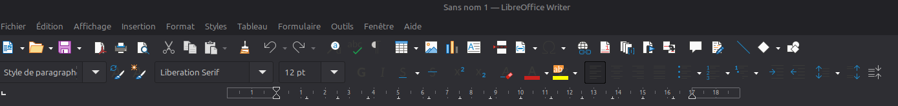
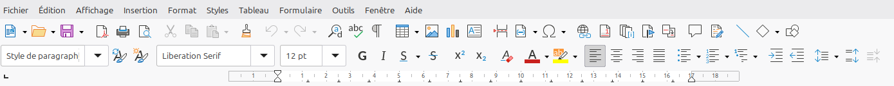

+++
title = "FAQ / configuration"
weight = 1
[params]
  menuPre = '<i class="fa-regular fa-circle-question"></i> '
+++

Dans cette page vous trouverez quelques aides pour vos premier pas avec Linux Mint.

La manière principale d'utiliser tout ces outils passe par le **menu Mint** en bas à gauche de votre écran. Comme avec Windows, vous pouvez l'activer avec la touche windows de votre clavier <i class="fa-brands fa-windows"></i>. Et vous pouvez ensuite taper le nom de l'application que vous souhaitez utiliser.

## Installer de nouveaux outils

{} 

Il existe un application graphique pour vous permettre d'installer des applications. 

Vous y retrouverez les mêmes applications qu'avec la commande `apt install` plus des applications utilisant le format `flatpack`.

> [!tip]
> Ouvrez le menu Mint <i class="fa-brands fa-windows"></i> et tapez : 
> - `logi` (ou `sofware` en anglais)

{}

## Capture d'écran

{} 

> [!tip]
> Ouvrez le menu Mint <i class="fa-brands fa-windows"></i> et tapez : 
> - `capture` (ou `screenshot` en anglais)

### Outil alternatif

[**Flameshot**](https://flameshot.org/) intègre quelques outils supplémentaire vous permettant de faire des annotations sur vos captures d'écrans.

Installez le avec le software manager :

### Ajouter un raccourci clavier

> [!tip]
> Ouvrez le menu Mint <i class="fa-brands fa-windows"></i> et tapez : 
> - `clavier` (ou `keyboard` en anglais)

Utilisez la commande `flameshot gui`

Sélectionner ensuite le raccourci de votre choix. Par exemple <kbd>ctrl</kbd>+<kbd>shift</kbd>+<kbd>s</kbd>

{}

## Changer la disposition des écrans

{} 
> [!tip]
> Ouvrez le menu Mint <i class="fa-brands fa-windows"></i> et tapez : 
> - `param` (ou `settings` en anglais)

Repositionnez vos écrans et cliquez sur appliquer.

{}

## Affichage des icones dans LibreOffice

{} 

Il est possible que dans certains cas l'affichage des icones dans LibreOffice ne soient pas très visible. Ce problème est lié au thème utilisé.

> [!tip]
> Ouvrez le menu Mint <i class="fa-brands fa-windows"></i> et tapez : 
> - `param` (ou `settings` en anglais)

Sélectionnez la catégorie thèmes et sélectionnez en un qui fonctionne pour vous et rend les icones plus visibles.

{}
