## Procedure d'installation de Linux Mint

1. Sélectionner `Start Linux Mint`

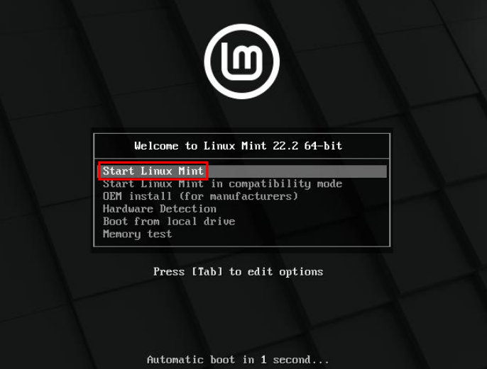

2. Cliquer `Install Linux Mint`
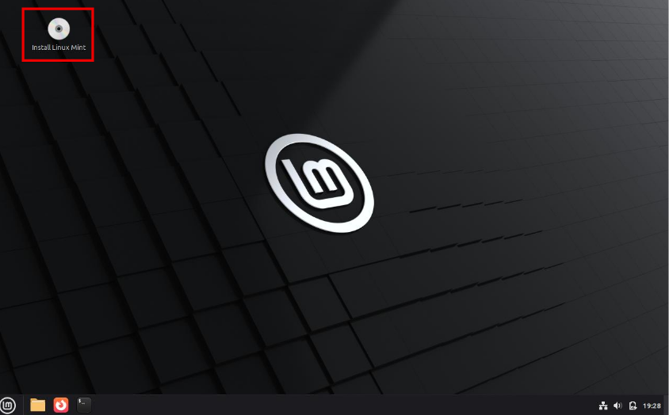

3. Choisir la langue et cliquer sur `Continuer`
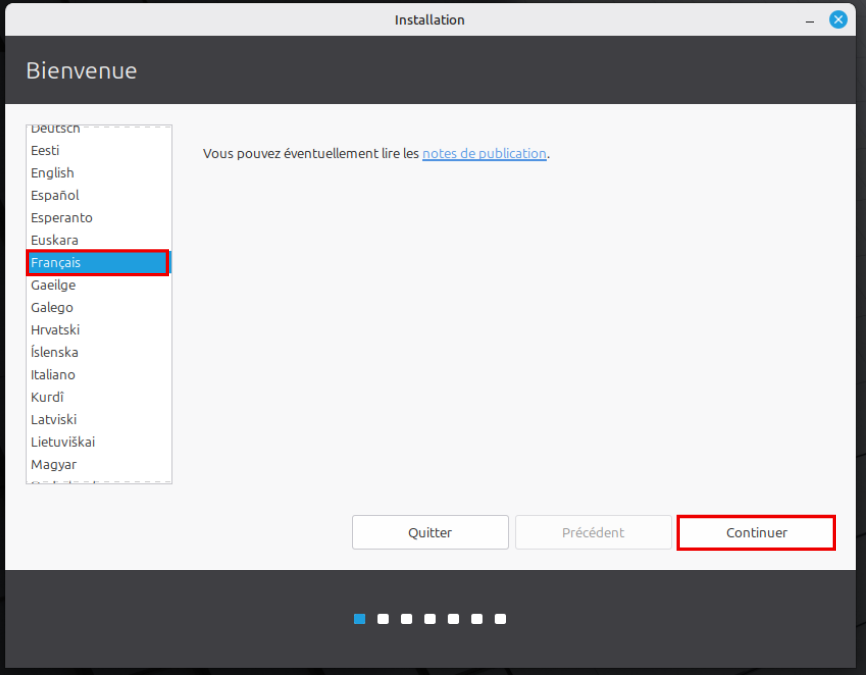

4. Choisir `French (Canada)` à gauche puis à droite. Cliquer sur `Continuer`
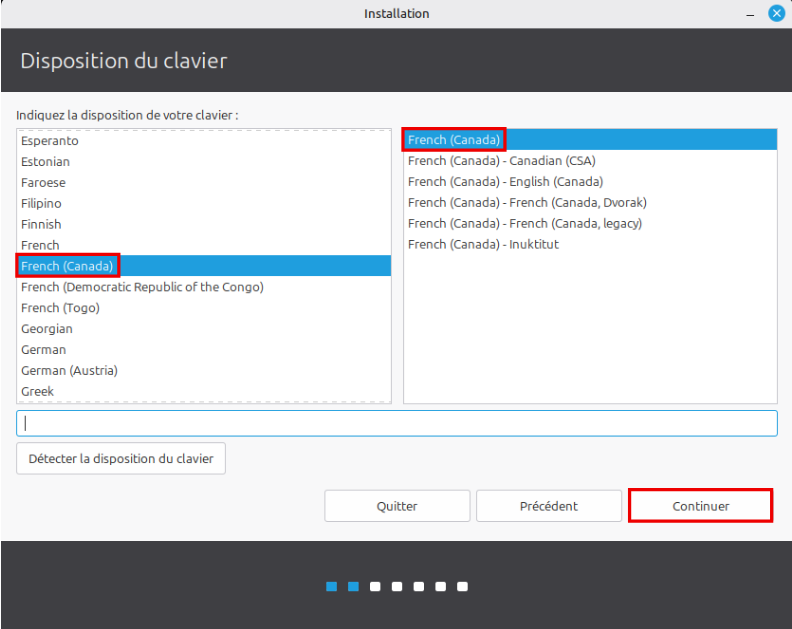

5. Cliquer sur `Installer les codecs multimédias` puis sur `Continuer`
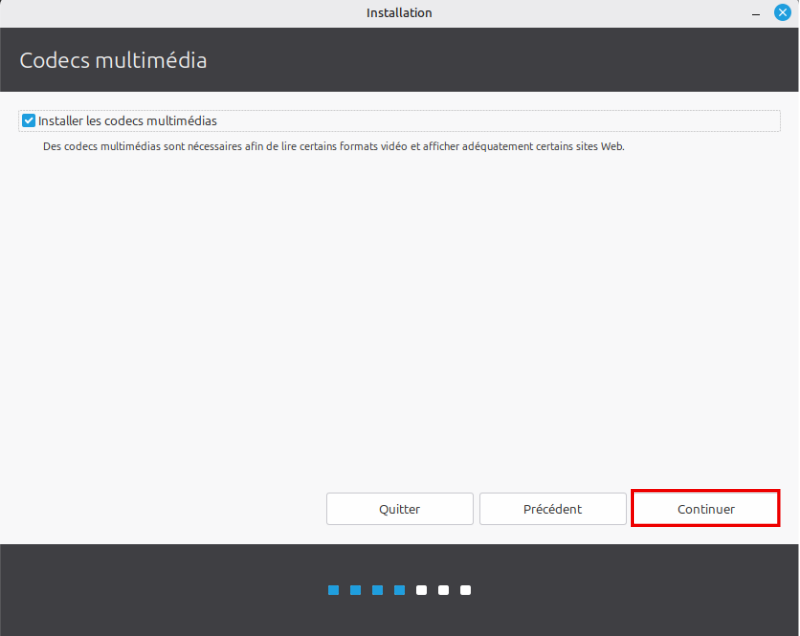

6. Cliquer sur `Effacer le disque et installer Linux Mint`
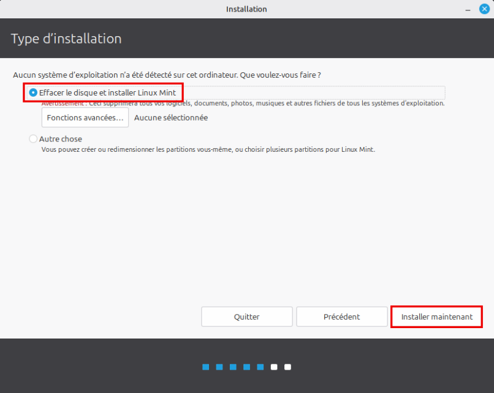

7. Cliquer sur `Continuer`
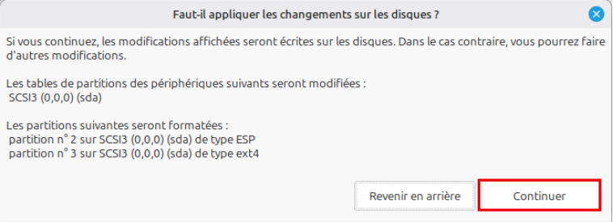

8. Cliquer sur `Continuer`
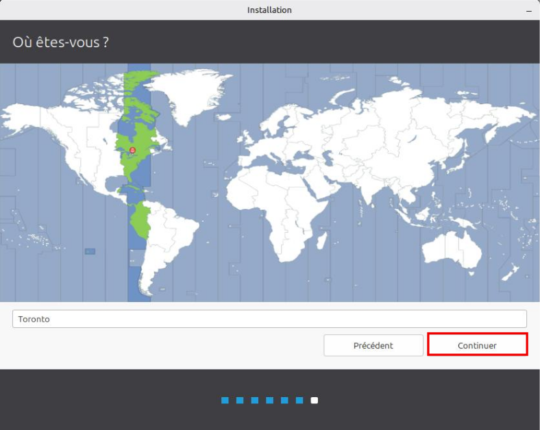

9. Remplir les informations puis cliquer sur `Continuer`. Retenez bien votre mot de passe !
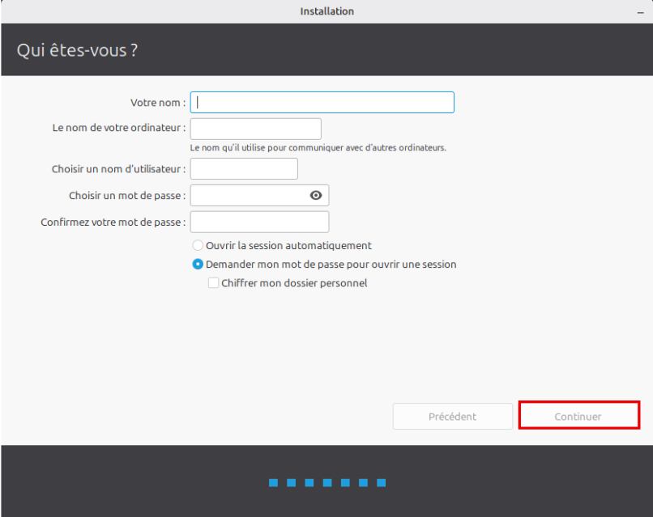

10. Cliquer sur `Redémarrer maintenant`
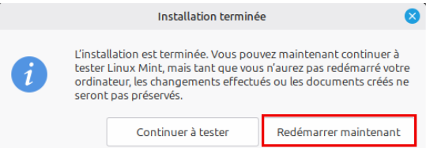

11. Retirer la clé USB puis faire `Entrée`
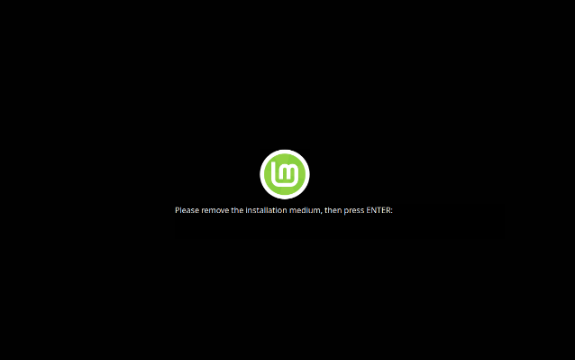

12. **L’environnement est installé, il faut le mettre à jour.** 

## Mise à jour de l'environement

### Première méthode :

Ouvrir le terminal.
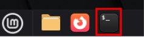

Ecrire les commandes suivantes :
1. sudo apt update
1. Si proposer : `O/n`, faire `Entrée`
1. Sudo apt upgrade
1. Si proposer : `O/n`, faire `Entrée`

### Seconde méthode :
En utilisant l'outil intégré de Mint en bas a droite de votre écran :

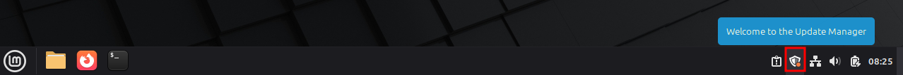

1. Cliquez dessus :
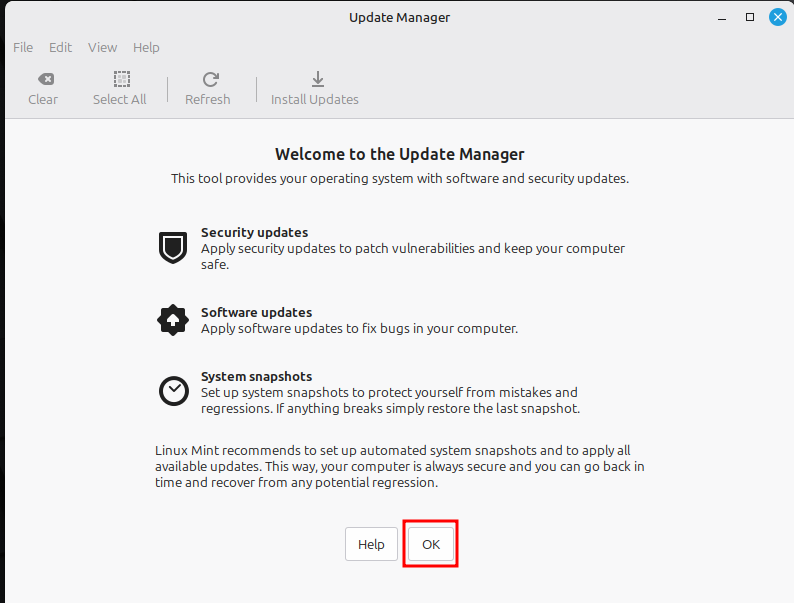

2. Avant de faire la mise à jour, il faut mettre l'outil à jour :

(il n'est pas nécéssaire de changer vers un mirroir local)
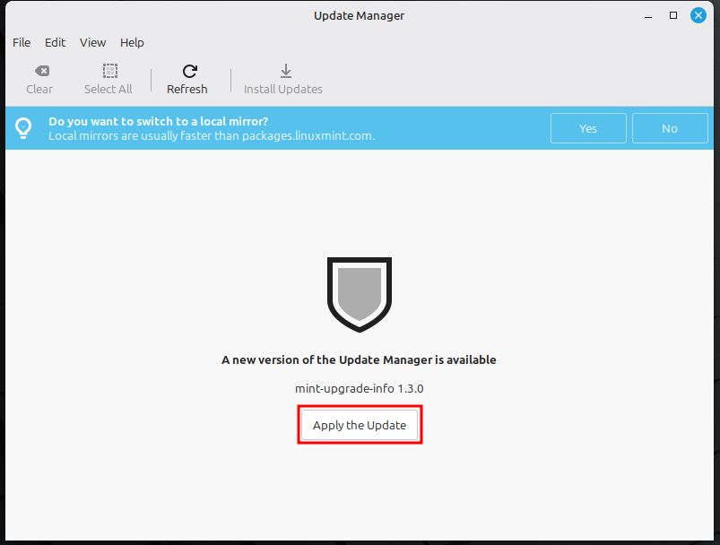

3. Entrez votre mot de passe :
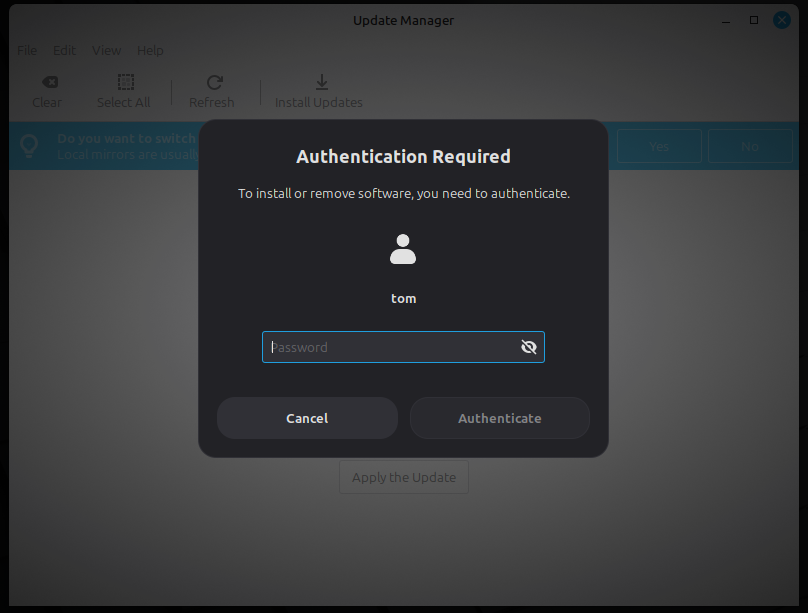

4. Installez les mise à jour :
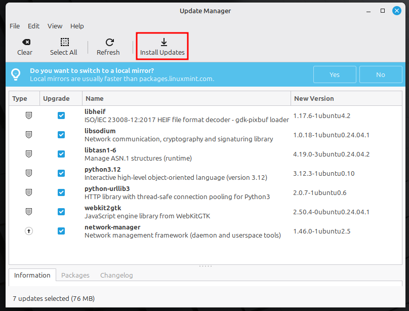

5 .Entrez votre mot de passe une nouvelle fois.

Et maintenant votre systeme est à jour prêt pour la suite.

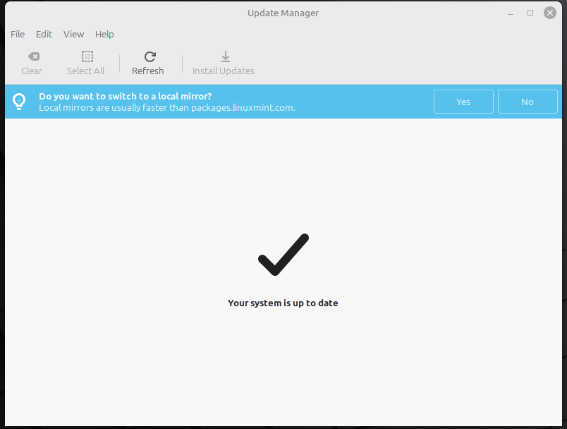

**Installation terminée !**

> [!tip] Mise à jour
> Pensez à faire les mises à jour régulièrement, vous serez prévenus d'une mise à jour lorsque le `manager` (en bas à droite) a une pastille orange.

## Installation de Virtual Box

Pour la suite de ce cours et pour d'autres cours de votre session, vous aller avoir besoin d'utiliser un logiciel de virtulisation de machine.

```bash
$ sudo apt install -y virtualbox
```

Entrez votre mot de passe quand il est demandé.

{} 
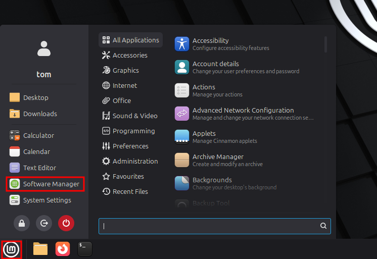

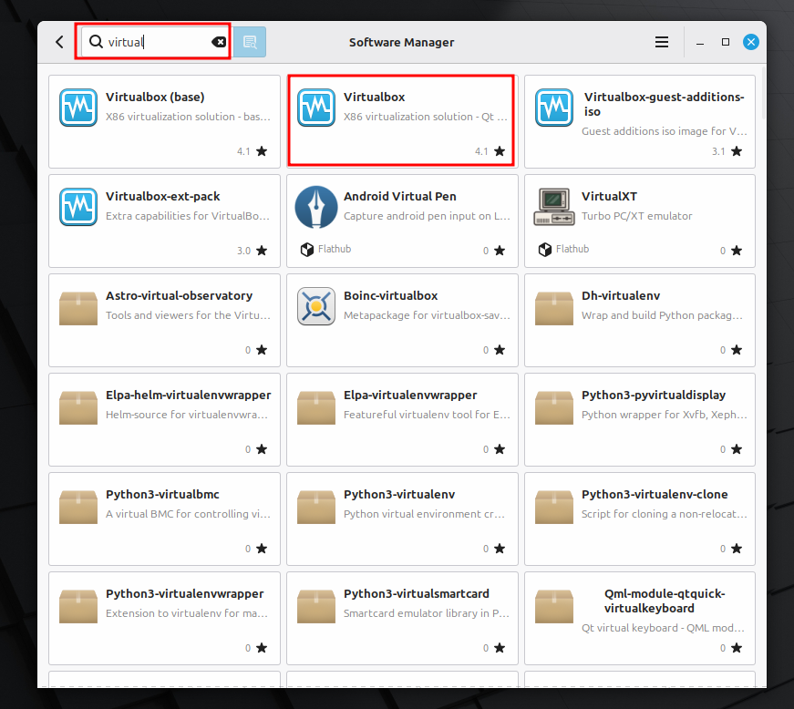

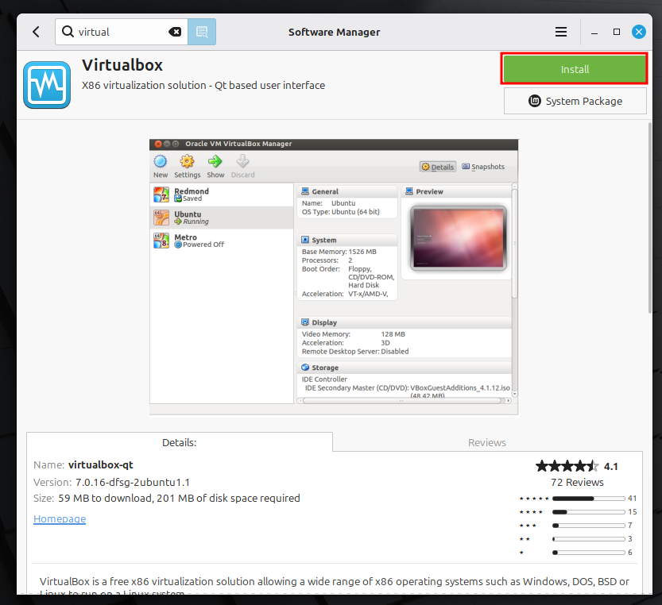

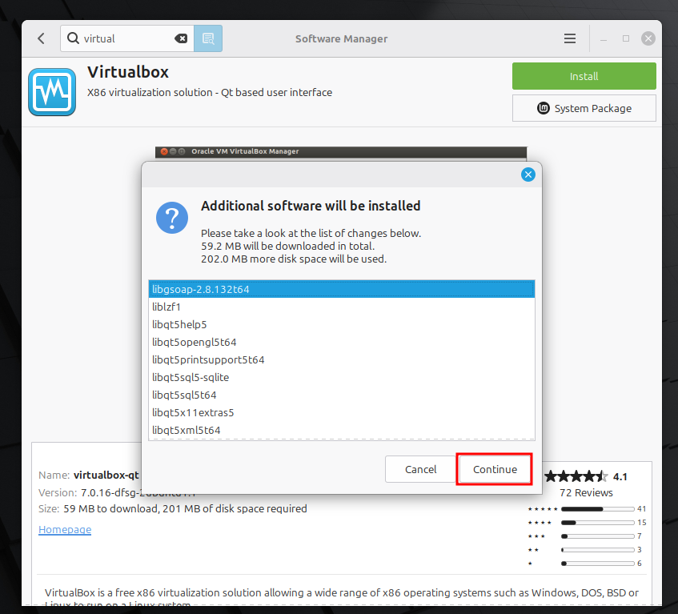

**Tapez votre mot de passe.**
{}

## Installation d'outils de développement

Nous allons ensuite installer quelques outils qui vous seront nécessaire pour la suite de votre session : 
- VScode
- VScodium (comme VScode, mais sans les outils d'espionnage de Microsoft, ni forcage de copilot.)
- git

Pour cela téléchargez le script suivant:
[install.sh](install.sh?download)

Ouvrez un terminal, et tapez les commandes suivante :

```bash
$ cd Download (ou cd Téléchargements si votre installation est en francais)
$ sudo bash install.sh
```