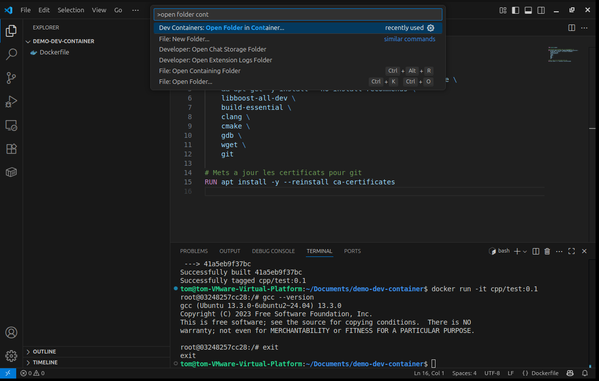
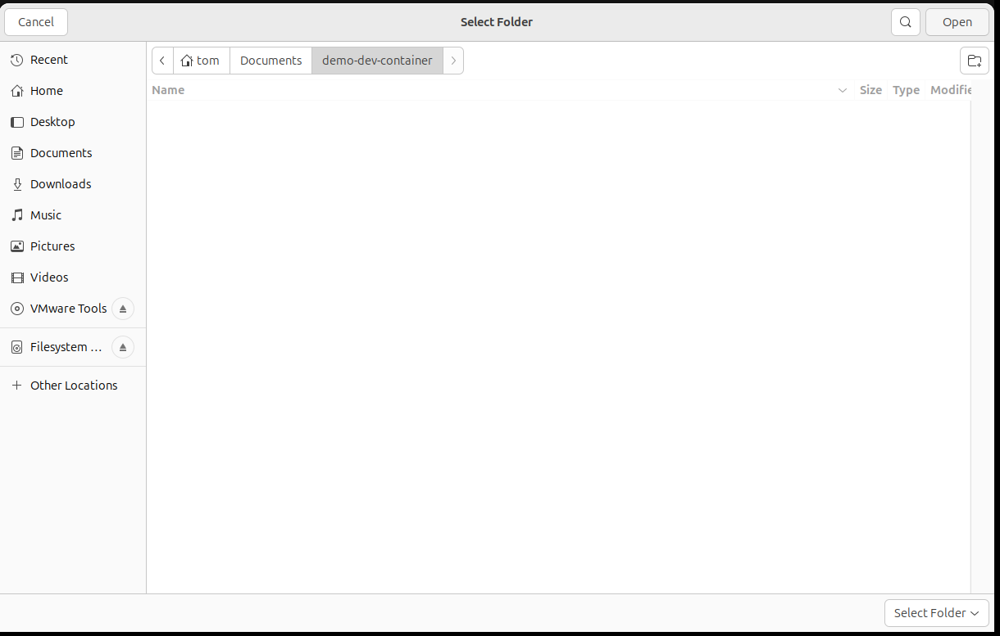
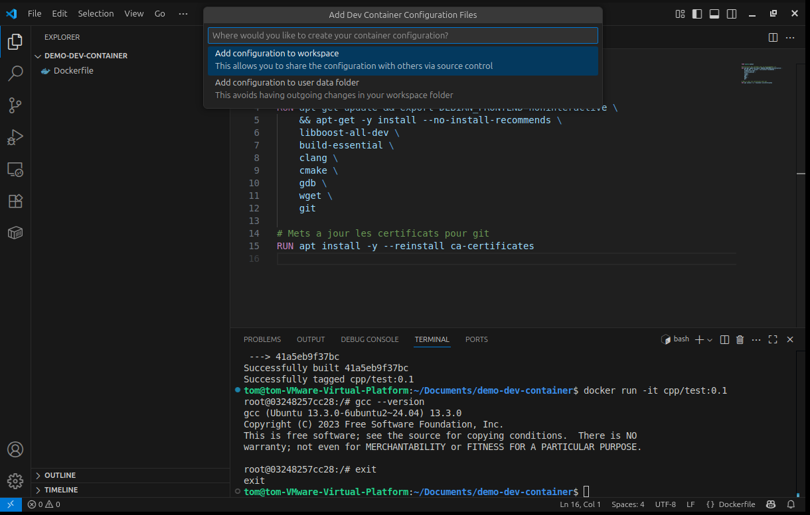
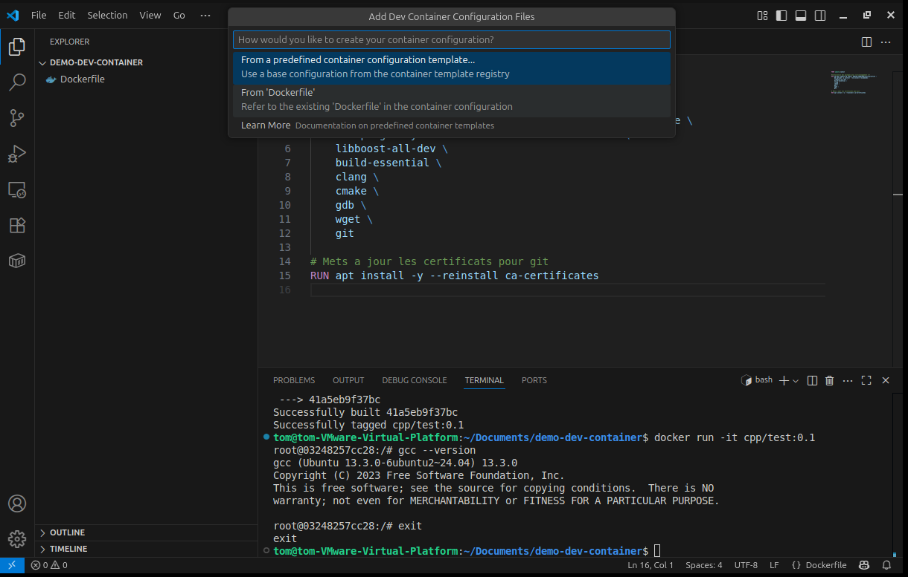
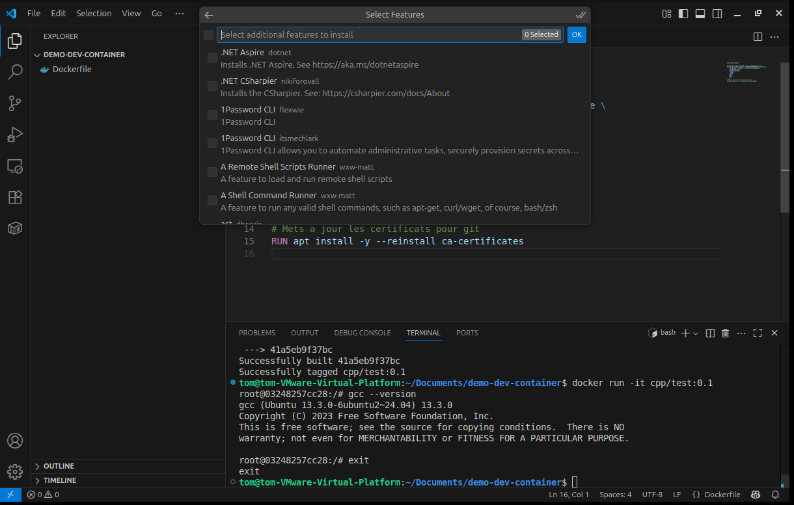
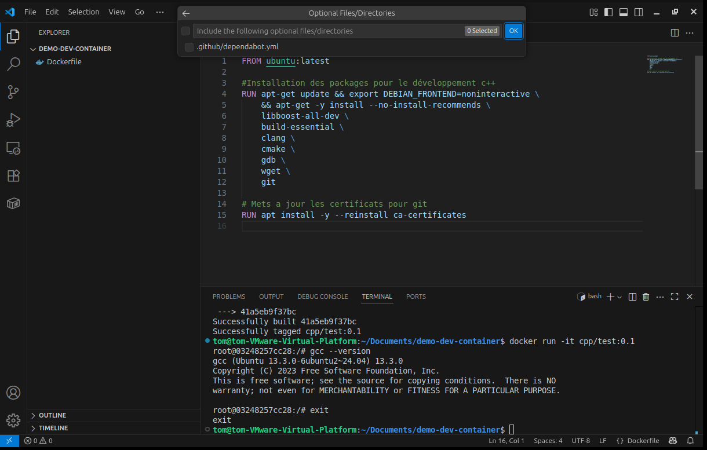
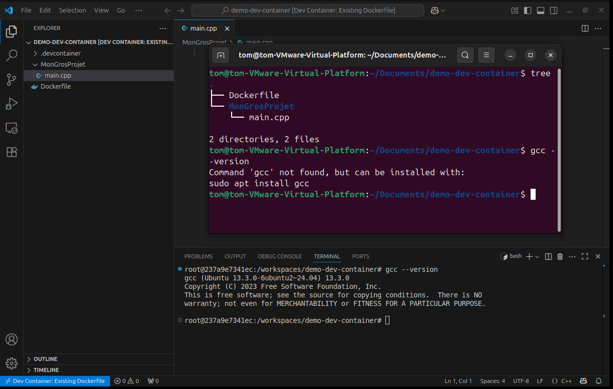

+++
title = "VScode"
weight = 20
+++

## Dev containers
- [Dev Containers](https://marketplace.visualstudio.com/items?itemName=ms-vscode-remote.remote-containers) : extension qui permet l'integration de docker comme environnement de developpement pour vscode.

1. Ouvrez le répertoire avec où vous souhaitez développer votre projet avec votre `Dockerfile`.
1. Appuyez sur : <kbd>CTRL</kbd>+<kbd>SHIFT</kbd>+<kbd>P</kbd> pour activer la palette de commande de vscode.
2. Cherchez `Dev Containers: Open Folder in Container`

3. Vous serez présenté a une sélection de répertoire. Sélectionnez le répertoire de votre projet.

4. Sélectionnez où sera stocké votre configuration (dans notre cas le worskpace est une bonne option).

5. Sélectionnes `from dockerfile`, nous allons utiliser celui que nous avons créé.

6. Ne rien selectionner, nous ajouterons nous même les dépendance manquantes.

7. Ne rien sélectionner.

8. VScode relance une fenêtre dans le container, avec votre répertoire de travail (sélectionné en 4.) monté à l'intérieur.

On constate que le terminal a la même version de `gcc` que le container qu'on avait exécuter manuellement, de plus nous somme dans le répertoire de la machine hôte, alors que celle-ci n'a pas `gcc` d'installé.

Le code que vous développerez dans VScode sera exécuté dans le container définie par votre `Dockerfile`