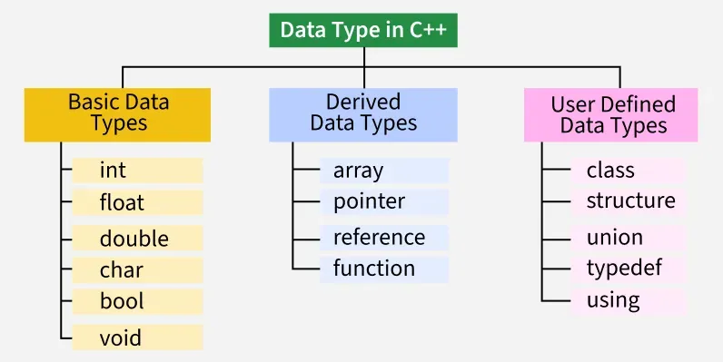

+++
title = "Types"
weight = 40
+++

## Les types de base

## Les pointeurs

https://medium.com/@raviduinduwara2001/7-steps-mastering-pointers-in-c-programming-58151e5864b2

## Sources
- https://www.geeksforgeeks.org/cpp/cpp-data-types/