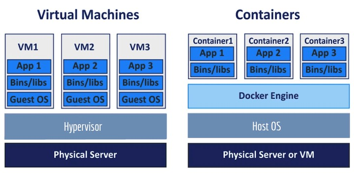
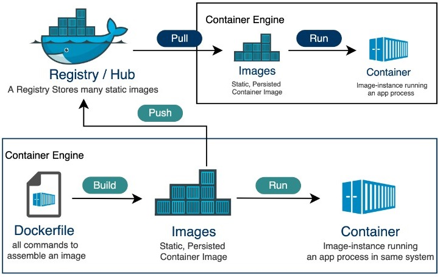
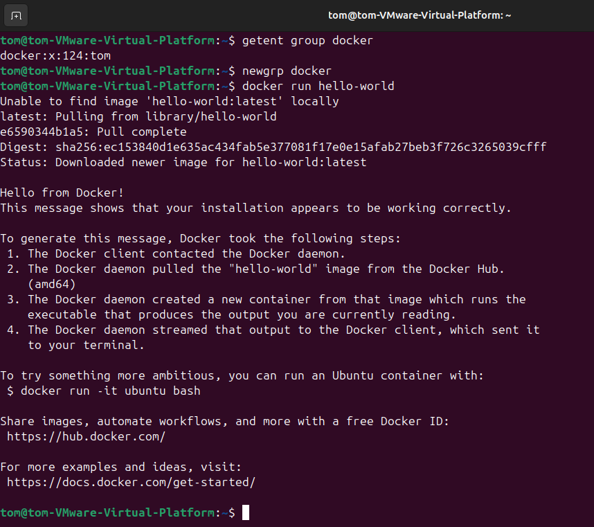
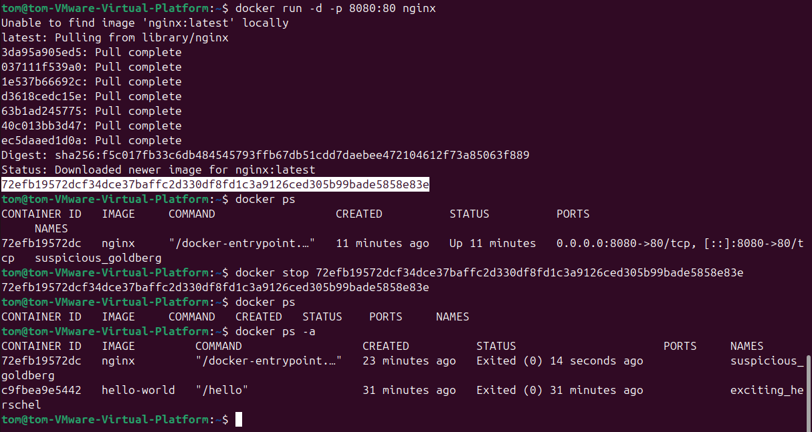
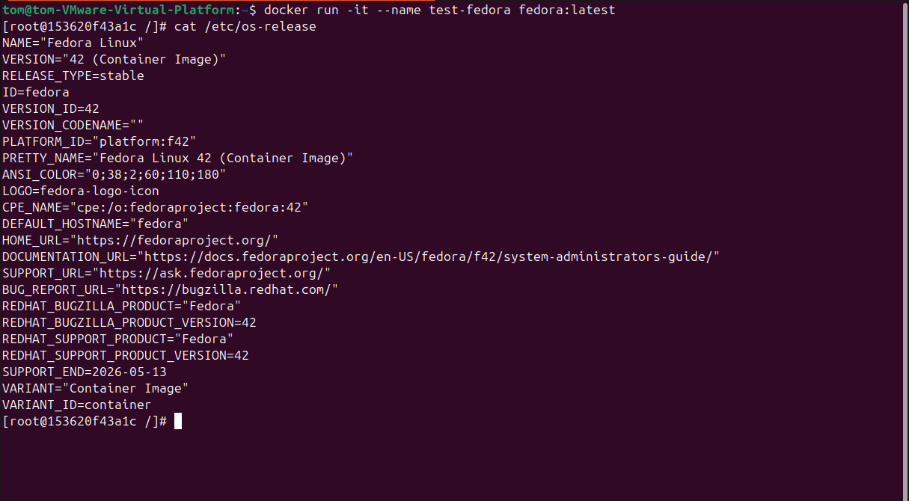
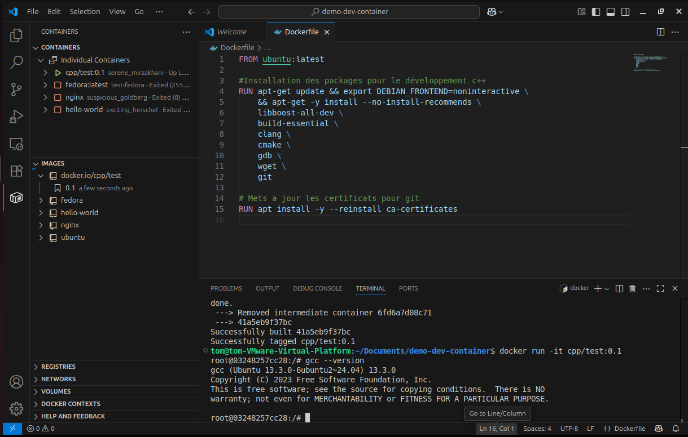

+++
title = "Docker"
weight = 10
+++

Ici on va voir l'utilisation de [Docker](https://www.docker.com/) pour nous aider à faire du développement logiciel, ce qui n'est qu'un sous ensemble de ce que permet de faire Docker et les conteneurs.

## Qu'est-ce qu'un conteneur

Un conteneur est une technologie qui permet d’isoler une application et toutes ses dépendances dans un environnement léger, portable (Docker est disponnible sur la pluspart des OS) et reproductible (grâce au [Dockerfile](#les-dockerfile)). Contrairement à une machine virtuelle, un conteneur partage le noyau du système d’exploitation avec l’hôte, ce qui le rend plus rapide à démarrer et moins gourmand en ressources.

Un conteneur contient tout ce dont une application a besoin pour fonctionner : le code, les bibliothèques, les variables d’environnement et les fichiers de configuration. Cela garantit que l’application s’exécutera de la même manière, quel que soit l’environnement (développement, test, production).

Docker est logiciel qui permet la création et l'utilisation de conteneurs.

Dans le cas du développement logiciel d'un projet avec plusieurs collaborateur, celà permet de garantire que tout le monde utilise le même environnement, par exemple la même version de nodejs, des librairies etc. 

### Différence conteneur - VM

Une machine virtuelle simule un ordinateur dans lequel on peut installer un OS invité. Dans le cas de Docker, on simule un OS pour le conteneur qui contient une application (un serveur web, une base de donnée etc...)

C'est ce qui permet aux applications d'être plus légères et donc plus rapide à lancer. A l'instar des machines virtuelles, les conteneurs ont aussi plusieurs mode de réseau : bridge, host, overlay et macvlan. Par défaut Docker utilise le mode bridge. Les autres modes peuvent être utiles dans le cas de développement de grosses applications web où la segmentation commence à être critique.

### Architecture de Docker


Docker fonctionne avec une architecture client serveur. Ce qui permet d'exécuter des application a distance et localement (ce qui sera notre cas le cours).

Le serveur, le *Docker Daemon* recoit les commandes du client Docker et télécharge des images (`docker pull`) depuis le répertoire de docker (*Docker hub*), construit les conteneurs (`docker build`), et les exécutes (`docker run`).

### Docker hub

C'est de [la](https://hub.docker.com/) que viennent les images que vous téléchargez avec docker. 
Une image peut etre un simple server web ngnix, un server DNS comme [piHole](https://hub.docker.com/r/pihole/pihole), un environnement de développement pour de l'IA ([image du llm Mistral](https://hub.docker.com/r/ai/mistral)), un serveur gitlab etc...


## Installation sur Linux
Il existe plusieurs distributions de docker, `docker-io`, `docker-ce`, `docker-ee`, etc.
Les versions `ce` et `ee` sont les versions officiel de docker, la `io` est la version distribuée par Debian. Ici nous utilisons la version `io` avec notre disctribution Ubuntu.

``` bash
$ sudo apt update
$ sudo apt install docker.io -y
$ sudo systemctl enable docker --now
$ docker --version
```

Pour pouvoir utiliser docker sans être root, il faut ajouter votre utilisateur au groupe docker.
``` bash
$ sudo usermod -aG docker $USER
$ getent group docker
$ newgrp docker
```


> [!info]
> La commande `newgrp docker` permet de vous ajouter au groupe sans vous log-out de linux. C'est utile pour quelques tests, mais vous êtes mieux de log-out log-in de votre session linux.


### Premiers tests
#### Hello world

Maintenant l'installation terminée, nous pouvons tester que toute la mécanique fonctionne avec le conteneur `hello-world`.
``` bash
$ docker run hello-world
```

Si tout est installé correctement, vous aurez ce message qui vous explique tout ce qu'il vient de passer pendant ce test.



#### Server web
Voici un autre exemple un peu plus avancé qui permet de lancer un server web dans un conteneur et on y accède depuis notre machine hôte sur le port 8080.
``` bash
$ docker run -d -p 8080:80 nginx
```
- L'option `-d` permet de détacher le conteneur, il s'exécute en arrière plan.
- L'option `-p 8080:80` redirige le port 80 du conteneur vers le port 8080 de l'hôte.

Grace à la commande `docker ps` on peut voir la liste de tous les conteneurs en cours d'exécution, ici on peut voir notre conteneur nginx et différentes informations sur son état.


Voici le résultat de la navigation depuis la machine hôte à l'adresse http://127.0.0.1:8080


Pour arréter le conteneur en cours d'exécution, on utilise la commande `docker stop` avec l'ID ou le nom du conteneur.


On constate que la commande `docker ps` nous montre maintenant que plus aucun conteneur est en cours d'execution. 

La commande `docker ps -a` permet de montrer tous les conteneurs qui ont été créer auparavant. On voit ici notre conteneur créé à partir de l'image `nginx` et notre premier test à partir de l'image `hello-world`.

#### Exécuter une disctribution Fedora dans docker

```bash
$ docker run -it --name test-fedora fedora:latest
```

- `-it` exécute le conteneur en mode `i`nteractif dans un `t`erminal.
- `--name` permet de donner un nom au conteneur ce qui permet une manipulation plus facile qu'avec un ID.



Comme on souhaite réutiliser le nom du conteneur, il faut d'abord le détruire, ce qui permet par la même occasion de libérer de la place sur le disque dur de la machine hôte.
```bash
$ docker rm test-fedora
```


## Les images
Une image Docker est un modèle immuable qui contient tout le nécessaire pour exécuter une application : le code, les bibliothèques, les dépendances, les variables d’environnement et les fichiers de configuration. Les images sont stockées sur des registres comme Docker Hub.

Une image Docker est constituée en couches, par exemple l'image de base nginx, suivit de la couche contenant la configuration de votre serveur, suivi par la couche contenant votre site etc...

Les images de base de CentOS, Ubuntu, Debian et Alpine Linux sont fréquemment utilisées. Pour des raisons de compatibilité et pour minimiser la taille de l'image, il est essentiel de sélectionner l'image de base appropriée.
Fichier Docker

Il est possible de pousser ses propres images sur le *docker hub*. Mais cela est au dela de ce qui nous intéresse ici.

### Commandes usuelles
- `docker pull nginx` : Récupère la dernière image Nginx depuis Docker Hub.
- `docker images` : Liste toutes les images disponibles sur la machine locale.
- `docker rmi nginx` : Supprime une image de la machine locale.

## Les Dockerfile

`Dockerfile` est un document texte contenant un ensemble d'instructions pour créer une image Docker. Ces instructions décrivent comment créer l'image de base, ajouter des fichiers et des répertoires, installer des dépendances, ajuster les paramètres et définir le point d'entrée du conteneur.

En spécifiant le processus de construction dans un Dockerfile, vous pouvez automatiser et répliquer le processus de création d'image, assurant ainsi la cohérence entre les environnements.


{} 
Voici un exemple de Dockerfile pour une conteneur nodejs

```dockerfile
FROM node:14
WORKDIR /usr/src/app
COPY package*.json ./
RUN npm install
COPY . .
EXPOSE 8080
CMD ["node", "app.js"]
```

- `FROM node:14` : nous utilisons l’image officielle de Node.js version 14 comme base.
- `WORKDIR` : définit le répertoire de travail dans le conteneur.
- `COPY package*.json` : copie les fichiers de configuration de dépendances.
- `RUN npm install` : installe les dépendances de l’application.
- `COPY . .`: copie le code source de l’application.
- `EXPOSE 8080` : indique que le conteneur écoutera sur le port 8080.
- `CMD` : commande utilisée lorsque le conteneur est exécuté.

Pour plus de détails :
- https://docs.docker.com/reference/dockerfile/

{}

## Les conteneurs

Un conteneur est une instance d'une image docker. C'est à dire, l'exécution du code contenu dans l'image. On peut voir l'image docker comme un disque dur en lecture seul sur une étagère, et le conteneur créé avec la commande `docker run` comme un ordinateur allumé avec ce disque dur.

Ici on peut voir le cycle de vie d'un conteneur. On peut remarquer qu'il ressemble beaucoup a celui d'une machine virtuelle, et de fait à celui d'un ordinateur physique.


> [!info]
> La commande `docker run -it ubuntu:latest` exécute en fait plusieurs actions:
> 1. Télécharge (`pull`) l'image depuis le registre si l'image n'existe pas déjà localement.
> 2. Exécute le conteneur (`start`)

### Commandes usuelles

- Créer un conteneur : `docker create` ou `docker run`
- Démarrer un conteneur : `docker start`
- Arrêter un conteneur : `docker stop`
- Redémarrer un conteneur : `docker restart`
- Supprimer un conteneur : `docker rm`

> [!warning]
> Attention à l'espace disponnible sur votre disque dur, vous pouvez avoir de nombreux containers stopé qui prennent de la place sur votre disque. Pensez à faire le ménage. Il en vas de même pour les images.
>
> Il est possible de d'automatiser la destruction du conteneur après son exécution en utilisant l'option `--rm` avec la commande `docker run --rm nom_image`

## Développer avec Docker

De manière générale, un conteneur est détruit après la fin de son exécution, ce qui rend l'accès aux données du conteneur impossible. Ce qui peut être pratique dans certaine situations, mais pas dans ntore cas. Par exemple vous ne voulez pas perdre le résultat de la compilation de votre projet une fois votre session de travail terminé.

Docker propose plusieurs mécanismes pour la persistance de données. Le mécanisme fréquement utilisé dans les applications web est le système de [volume Docker](https://www.tutorialspoint.com/docker/docker_volumes.htm), qui offre une manière de garder les données d'un conteneur géré par docker. Une autre méthode est le *bind mount* qui permet de monter un répertoire de la machine hôte à l'intérieur du conteneur. C'est ce que nous allons utiliser ici.

### Monter le repertoire de travail dans le conteneur

```bash
$ docker run -it --name test-fedora --volume /home/tom/Documents:/tmp fedora:latest
```

- `--volume /home/tom/Documents:/tmp` permet de monter le repertoire hote Documents dans le repertoire `/tmp` du conteneur.


### Créer un Dockerfile avec les outils de développement C++

Voici un Dockerfile minimal pour le developpement C++ :

```
FROM ubuntu:latest

#Installation des packages pour le développement c++
RUN apt-get update && export DEBIAN_FRONTEND=noninteractive \
    && apt-get -y install --no-install-recommends \
    libboost-all-dev \
    build-essential \
    clang \
    cmake \
    gdb \
    wget \
    git

# Mets a jour les certificats pour git
RUN apt install -y --reinstall ca-certificates

```

La commande ci dessous permet de construire l'image. Le `.` à la fin de la commande désigne le répertoire où se trouve le Dockerfile.

```
$ docker build -t cpp/test:0.1 .
```

Cette commande exécute le conteneur à partir du conteneur qu'on vient de créer:
```
$ docker run -it --rm cpp/test:0.1 
```

On peut ensuite constater qu'il y a bien la dernière version de gcc d'installée.


> [!tip]
> S'il manque des dépendances dans votre conteneur au cours du développement de votre application, par exemple vous exécutez la commande `apt install curl` dans votre conteneur. Il est important d'ajouter ces dépendances dans le ficher Dockerfile. 
>
> Si vous ne mettez pas cette nouvelle information dans le Dockerfile, vous devrez retaper cette commande lors de l'instanciation d'un nouveau conteneur.
>
> Une fois cette modification faite, vous devrez reconstruire une nouvelle image avec la commande: `$ docker build -t cpp/test:0.2 .`.


### Intégration Docker VScode

Nous allons utiliser deux extensions vscode pour nous aider avec docker:
- [Container tools](https://marketplace.visualstudio.com/items?itemName=ms-azuretools.vscode-containers) : extension permettant la gestions des ressources docker dans vscode:

- [Dev Containers](https://marketplace.visualstudio.com/items?itemName=ms-vscode-remote.remote-containers) : extension qui permet l'integration de docker comme environnement de developpement pour vscode. Plus de détails [**ici** {}](../../base-de-connaissances/vscode/#dev-containers) 

## Alternatives à docker

Il existe de nombreuses alternatives à docker, voici les 2 plus populaires en ce moment:

1. **Podman**: Remplacement quasi un pour un de Docker. Podman est compatible avec les commande docker `$ docker run` -> `$ podman run`.
Un des principale différence avec Docker c'est qu'il n'utilise pas une architecture client serveur.
1. **LXC / LXD**: Gestion de conteneur inclus dans le noyeau linux. Les premières version de Docker étaient basé sur LXC. LXD s'appuie sur LXC, pour offrir une meilleur expérience utilisateur.


## Source
- https://www.tutorialspoint.com/docker/index.htm
- https://www.geeksforgeeks.org/devops/architecture-of-docker/
- https://docs.docker.com/manuals/
- 