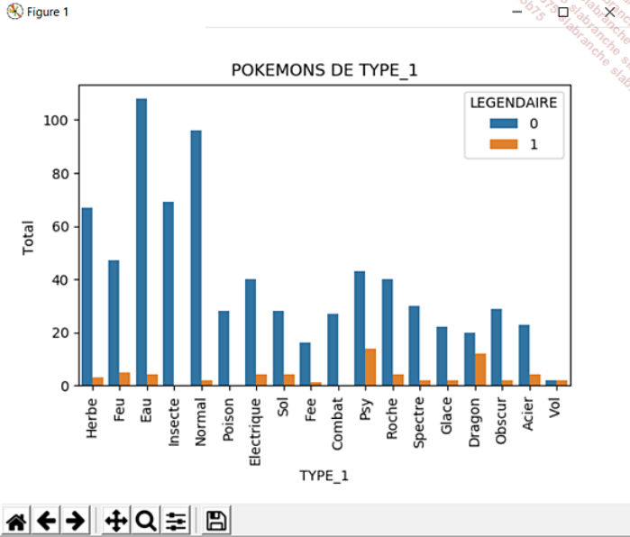
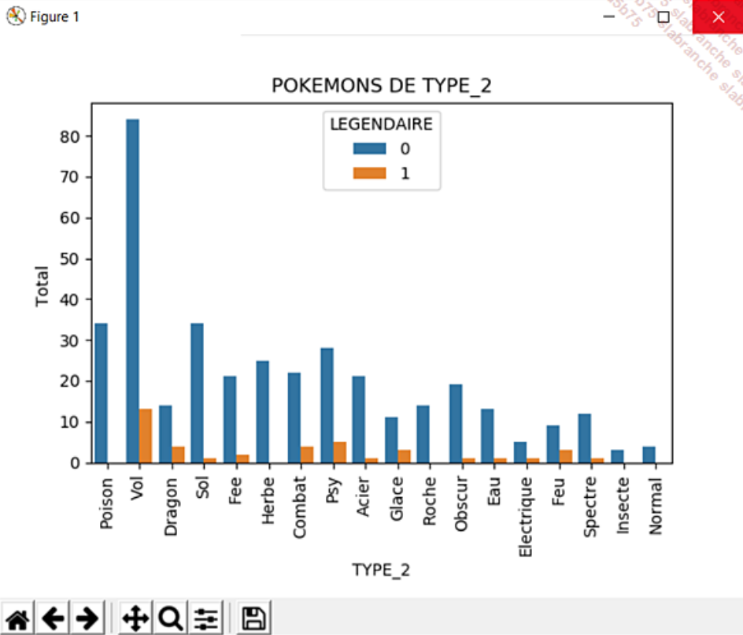
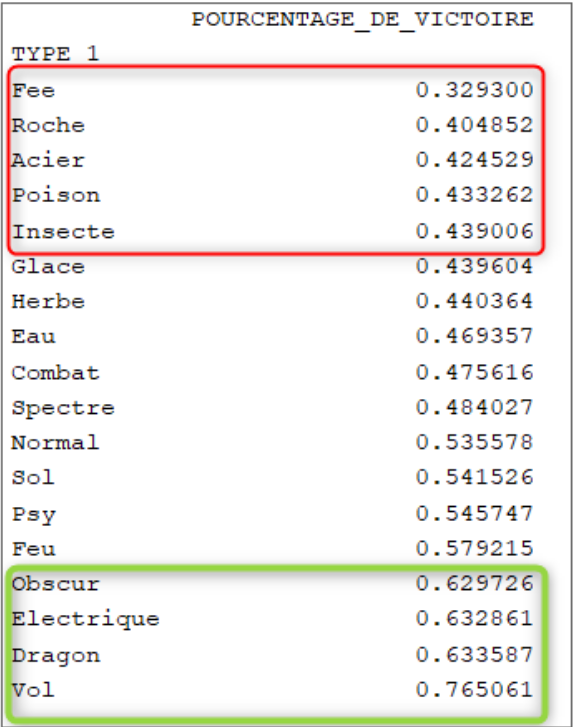
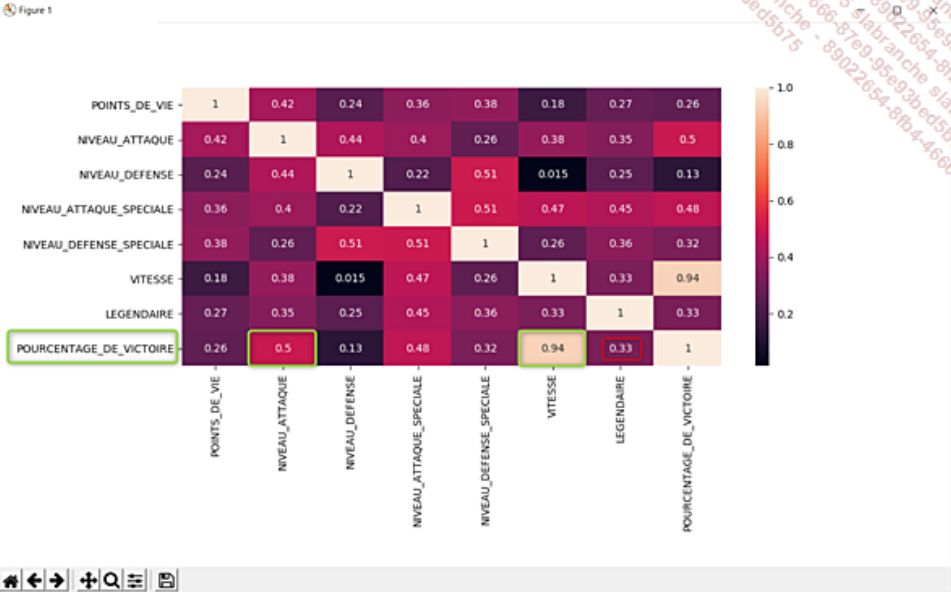
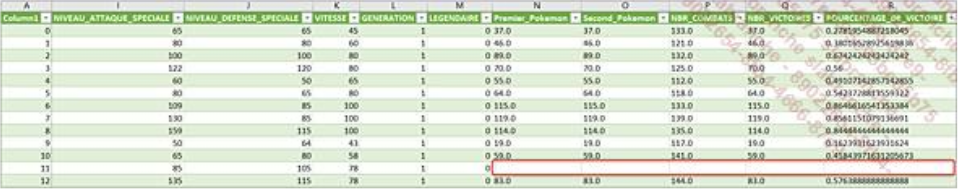
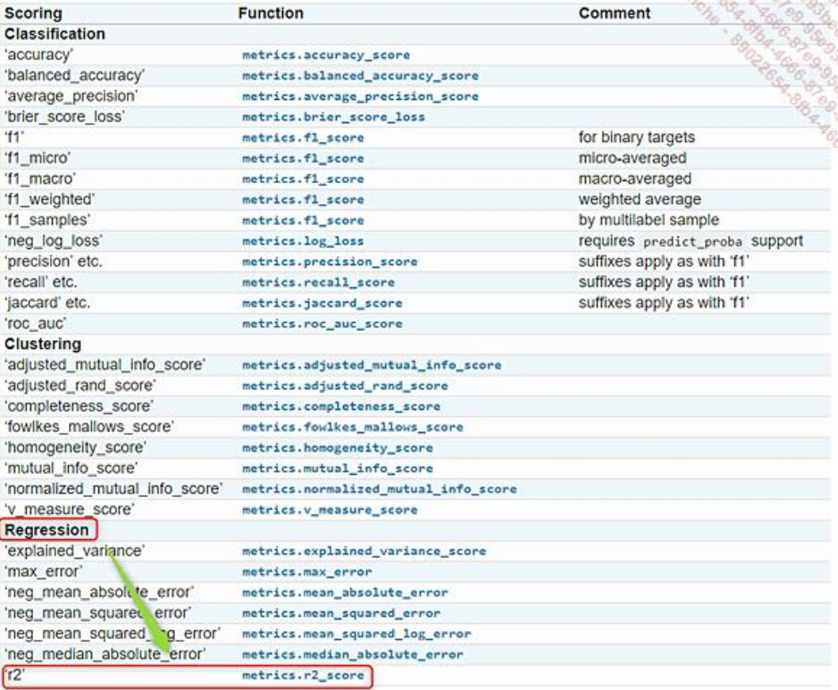

+++
title = "Partie 2"
weight = 120
draft = true
+++


## Objectif

Ce laboratoire mettra en application les principes d'apprentissage machine vus en classe. Nous utiliserons les données travaillées sur les Pokémon avec divers algorithmes pour prédire le Pokémon gagnant d'un combat.

## Remise

Pour me montrer que vous avez bien fait ce laboratoire, vous prenez une dizaine de captures d'écran de votre progression, ainsi que les résultats de 5 combats simulés et choisis par vous à la fin.

Vous faites un tableau avec les noms des 2 Pokémon, la prédiction de l'algorithme ainsi que le résultat réel du combat. Il se peut que les résultats obtenus, surtout les pourcentages de victoire, diffèrent de l'exemple.

Ce laboratoire compte pour 5% de votre session.

## Source

Le texte et l'exemple proviennent du livre :
Vannieuwenhuyze, Aurélien. Intelligence artificielle vulgarisée, ENI, 2019. 434 p.

---

## Ce que nous allons découvrir et les prérequis

Dans le chapitre précédent, nous avons constitué un jeu d'observations qui va nous permettre d'entamer la démarche d'analyse et de recherche de solution à notre problème, à savoir déterminer le Pokémon à utiliser lors d'un combat dans le but de le gagner.

Nous allons commencer ce chapitre par un peu de statistiques, mais n'ayez crainte, cela reste simple de compréhension.

---

## Un peu de statistiques

Avant d'entrer dans le vif du sujet, nous allons faire un peu de statistiques sur notre jeu d'observations à l'aide de la fonction `describe()` du module Pandas.

```python
print(nouveauPokedex.describe())
```

Cette fonction a pour but d'expliquer statistiquement chaque feature de notre ensemble d'observations dans le but d'en dégager quelques caractéristiques intéressantes.

À titre d'exemple, prenons le résultat de l'analyse statistique de la feature NIVEAU_ATTAQUE.

| Module | Définition | Valeur |
|---------|------------|---------|
| Count | Nombre d'observations | 800 |
| Mean | La moyenne des observations | 79.001250 |
| Std | L'écart type | 32.457366 |
| min | La valeur minimale des observations | 5 |
| 25% | | 55 |
| 50% | | 75 |
| 75% | | 100 |
| Max | La valeur maximale des observations | 190 |

### 1. Le nombre de données (count)

On constate que 800 observations ont été renseignées pour la feature NIVEAU_ATTAQUE. Cela signifie qu'il ne manque pas de données.

### 2. La moyenne (mean)

Le niveau d'attaque moyen des Pokémons est de 79, c'est-à-dire qu'en dessous de cette moyenne on peut considérer que le Pokémon a un niveau faible, et au-dessus qu'il a un niveau fort, pouvant alors aider à gagner le combat. Nous disposons donc d'une première information intéressante.

### 3. L'écart type (Std pour Standard Deviation)

L'écart type est une valeur statistique, permettant de montrer la répartition des données autour de la moyenne. Plus sa valeur est petite, plus les données sont proches de la moyenne, dans le cas contraire, elles sont éloignées.

Dans notre cas, l'écart type est de 32, signifiant que les données de la feature NIVEAU_ATTAQUE semblent être assez éloignées de la moyenne. Cela signifie qu'il existe de nombreux cas différents de niveaux d'attaque et que les observations ne sont pas homogènes. C'est un point que nous devrons vérifier lors de la visualisation des données.

### 4. Les valeurs minimales et maximales

Les attributs min et max correspondent à la valeur minimale et à celle maximale des observations de la feature.

Ainsi, on note l'existence d'un ou plusieurs Pokémons ayant un niveau d'attaque à 5 et un ou plusieurs autres ayant un niveau d'attaque à 190.

Là encore, cette information peut nous servir dans notre choix du Pokémon, car plus son niveau maximal d'attaque est fort, plus il a de chances de remporter le combat.

### 5. Les quartiles

Les quartiles sont utilisés en statistiques pour séparer les observations en quatre groupes homogènes.

Pour comprendre la notion de quartiles, prenons l'ensemble des observations de notre feature NIVEAU_ATTAQUE et découpons-les en quatre parties égales :

En observant la figure, on constate que :
• 25 % des Pokémons ont un niveau d'attaque inférieur à 55,
• 50 % des Pokémons ont un niveau d'attaque inférieur à 75,
• 75 % des Pokémons ont un niveau d'attaque inférieur à 100.

Ces informations nous permettent d'affirmer que peu de Pokémons ont un taux d'attaque supérieur à 100 (seulement 25 %). Là encore, cette donnée est importante, car si nous voulons gagner un combat, il faut que nous utilisions un Pokémon présent dans ce dernier quartile.

### 6. Description de notre jeu d'observations

À présent que nous venons d'analyser une caractéristique précise, nous devons réaliser l'analyse complète des observations afin d'avoir une vue globale des données tout en gardant en tête le problème à résoudre.

L'analyse statistique nous permet-elle d'identifier des données singulières ?

Tout d'abord, on constate que les résultats des combats se basent sur les données numériques (VITESSE, NIVEAU_ATTAQUE…), nous pouvons donc exclure les features NOM, TYPE_1,TYPE_2.

Est-il important de s'intéresser au numéro du Pokémon ? Non, car il s'agit d'un identifiant, par conséquent cela n'a pas de lien dans le fait de gagner ou non un combat.

Certains Pokémons n'ont qu'un point de vie ! Ce sont les Pokémons que nous devrons éviter d'utiliser lors d'un combat.

25 % des Pokémons ont une vitesse supérieure à 90 (dernier quartile). Être rapide lors d'un combat peut être un avantage !

On constate un écart type de 11 pour la feature Combat. Cet écart type est le plus bas de l'ensemble des données. Cela signifie que les Pokémons ont tous réalisé un nombre de combats proche de la moyenne, c'est-à-dire proche de 127.

Cette valeur nous permet de dire que les observations contenues dans le jeu de données sont assez qualitatives, car il n'y a pas de Pokémon ayant davantage combattu par rapport aux autres, ce qui ne nous permettrait pas d'avoir un jeu d'apprentissage reflétant la réalité.

En effet, si seuls les Pokémons Bulbizarre et Dracaufeu avaient réalisé des combats, nous n'aurions aucune information sur ceux réalisés par Pikachu et nous aurions peut-être considéré que Bulbizarre ou Dracaufeu sont plus forts que Pikachu, alors que ce n'est peut-être pas le cas.

---

## Quels sont les types de Pokémons qu'un dresseur doit posséder ?

Répondre à notre problématique, c'est se mettre à la place d'un dresseur de Pokémons. Afin de maximiser les chances de gagner, il faut que le dresseur de Pokémons dispose des principaux Pokémons du Pokédex dans sa collection.

En effet, en ayant les Pokémons les plus fréquemment rencontrés, cela signifie que les adversaires ont de grandes chances de posséder les mêmes. Sachant que deux Pokémons de même type peuvent contrer les attaques, cela peut donc éviter de perdre le combat (https://pokemondb.net/type/dual).

Pour connaître ces Pokémons indispensables à tout dresseur, nous allons utiliser un graphique qui nous permettra de visualiser rapidement leur nombre en fonction de leur type. Voici le code à utiliser :

On note l'import du module matplotlib, et l'utilisation du module seaborn, tous deux nécessaires à la représentation graphique des données.

```python
import matplotlib.pyplot as plt
import seaborn as sns

axe_X = sns.countplot(x="TYPE_1", hue="LEGENDAIRE", data=nouveauPokedex)
plt.xticks(rotation= 90)
plt.xlabel('TYPE_1')
plt.ylabel('Total ')
plt.title("POKEMONS DE TYPE_1")
plt.show()
```



Idem pour les Pokémons de type 2 :

```python
axe_X = sns.countplot(x="TYPE_2", hue="LEGENDAIRE", data=nouveauPokedex)
plt.xticks(rotation= 90)
plt.xlabel('TYPE_2')
plt.ylabel('Total ')
plt.title("POKEMONS DE TYPE_2")
plt.show()
```


Ce qui nous permet d'affirmer qu'un dresseur doit posséder dans sa collection des Pokémons ayant pour premier type "Herbe", "Eau", "Insecte" et "Normal". Puis "Vol", "Poison" et "Sol" en second type pour pouvoir contrer les attaques, car ce sont ces Pokémons qui ont une barre d'histogramme plus importante que les autres.

Voilà une première information intéressante !

Maintenant, essayons de déterminer les Pokémons ayant un taux de victoire supérieur aux autres.

---

## Les types de Pokémons gagnants et perdants

Il est à notre sens important de connaître les types de Pokémons gagnants. En effet, en s'assurant de les avoir dans sa collection et de les utiliser dans les combats, le dresseur a de fortes chances de gagner.

Pour obtenir cette information, on calcule la moyenne des pourcentages de victoires de chaque Pokémon. Cette moyenne, calculée et groupée par type de Pokémon, est ensuite triée par ordre croissant :

```python
print(nouveauPokedex.groupby('TYPE_1').agg({"POURCENTAGE_DE_VICTOIRES": "mean"}).sort_values(by = "POURCENTAGE_DE_VICTOIRES"))
```



On peut donc en déduire que les Pokémons gagnants sont de type :
• **Obscur**
• **Électrique**
• **Dragon**
• **Vol**

Nous pouvons également affirmer que les types de Pokémons suivants sont souvent voués à perdre leur combat :
• **Fée**
• **Eau**
• **Roche**
• **Acier**
• **Poison**

Peut-on déjà en déduire quelque chose ? Si l'on prend le Pokémon, héros de la série, nommé Pikachu, de type électrique et qu'on le compare à un Pokémon Fée, on peut en déduire que Pikachu a de grandes chances de remporter le combat.

Si vous jouez personnellement aux Pokémons, possédez-vous la majorité des Pokémons du Pokédex ? Avez-vous également des Pokémons de types électrique, obscur, dragon et vol ?

Si ce n'est pas le cas, il faut d'urgence vous en procurer. Ce sont les statistiques qui l'affirment !

---

## Essayons de trouver une corrélation entre les données

Une corrélation entre deux données signifie que celles-ci ont un lien fort entre elles. Exemple le statut d'adulte et l'âge de 18 ans, le fait de savoir voler et d'être pourvu d'ailes…

Dans notre cas, il s'agit de déterminer l'existence de features ayant un lien fort avec la capacité à gagner un combat. Faut-il être rapide ? Faut-il avoir un grand niveau d'attaque ? C'est ce que nous allons découvrir.

Avant toute chose, nous devons nous questionner sur l'utilité de l'ensemble des données en nous posant la question : "Cette feature peut-elle avoir un impact sur le fait de gagner ou non le combat ?"

• **Le numéro** : non, car différent pour chaque Pokémon.
• **Le nom** : non, car différent pour chaque Pokémon.
• **Le type_1** : oui, car nous venons de voir que certains types de Pokémons sont propices à la victoire.
• **Le type_2** : non, car tous les Pokémons n'ont pas de second type.
• **Les points de vie** : oui, car plus on a de points de vie, plus on a de chance de gagner.
• **Les différents niveaux** (attaque, défense, attaque spéciale, défense spéciale) : oui, car ce sont des caractéristiques propres au combat.
• **La vitesse** : oui, car c'est aussi une caractéristique de combat.
• **Légendaire** : oui, car un Pokémon légendaire disposerait d'une force supplémentaire.

Pour permettre de visualiser la corrélation entre les features, nous allons utiliser un graphique appelé HeatMap se construisant comme suit :
• Calcul de la corrélation des différentes features
• Création du graphique à partir de la corrélation calculée

```python
corr = nouveauPokedex.loc[:,['POINTS_DE_VIE','NIVEAU_ATTAQUE',
'NIVEAU_DEFENSE','NIVEAU_ATTAQUE_SPECIALE','NIVEAU_DEFENSE_SPECIALE',
'VITESSE','LEGENDAIRE','POURCENTAGE_DE_VICTOIRES']].corr()

sns.heatmap(corr,
xticklabels=corr.columns,
yticklabels=corr.columns, annot=True)
plt.show()
```



Si vous rencontrez un problème d'exécution du script à cette étape, supprimez la colonne POURCENTAGE_DE_VICTOIRES dans le code que vous venez de saisir, puis après avoir exécuté une première fois le code, vous pouvez à nouveau l'ajouter. Le souci provient du fait que la colonne n'est pas correctement indexée.

À la lecture de ce graphique créé à l'aide du module Seaborn, on constate que la feature Type_1 n'est pas présente. Cela vient du fait que ce n'est pas une valeur numérique et elle se trouve donc exclue !

### Comment lire ce graphique ?

La corrélation se faisant entre deux features, il faut prendre la feature située à gauche du graphique (axe des ordonnées) et la croiser avec celle située en bas (axe des abscisses). Le chiffre se situant à l'intersection des deux features correspond au pourcentage de corrélation. Plus il se rapproche de 1, plus la corrélation est forte.

Si l'on considère la feature qui nous intéresse, à savoir le pourcentage de victoires, le taux de corrélation est égal à 1 lorsqu'elle est comparée à elle-même ce qui est tout à fait normal. S'en suit la feature Vitesse montrant une corrélation de 0,94 ! Puis celle de la feature Niveau d'attaque s'élevant quant à elle à 0.50.

Par conséquent, nous pouvons en déduire que la victoire est quasi acquise lors d'un combat pour le Pokémon le plus rapide des deux et ayant un niveau d'attaque supérieur à son adversaire.

Une petite déception tout de même sur la feature LEGENDAIRE qui s'avérait prometteuse. Car dans la littérature, il est indiqué qu'un Pokémon légendaire possède une force supérieure aux autres, ce qui lui permettrait de gagner facilement les combats. Cependant, on constate que sa valeur de corrélation est seulement de 0.33.

---

## Résumé de nos observations

Si l'on résume les observations que nous avons effectuées, nous pouvons dire que pour remporter la victoire lors d'un combat, le dresseur de Pokémons doit :

• Posséder des Pokémons de type herbe, eau, insecte et normal, ce qui lui permet de contrer les attaques,
• Posséder des Pokémons de type obscur, électrique, dragon et vol, car ce sont eux qui ont un taux supérieur de victoire,
• Utiliser un Pokémon ayant une grande vitesse,
• Utiliser un Pokémon ayant un bon niveau d'attaque.

---

## Vérifions nos hypothèses

Il nous faut à présent vérifier nos hypothèses en sélectionnant quelques combats dans le fichier combats.csv.

```
155,321,155
101,583,583
404,32,32
```

Au vu de ces résultats, nos hypothèses semblent donc vérifiées.

| NUMERO | NOM | TYPE | NIVEAU ATTAQUE | VITESSE | VAINQUEUR |
|---------|-----|------|----------------|---------|-----------|
| 275 | Jungko | Herbe | 85 | 120 | |
| 155 | Méga-Ptéra | Roche | 135 | 150 | OUI |

| NUMERO | NOM | TYPE | NIVEAU ATTAQUE | VITESSE | VAINQUEUR |
|---------|-----|------|----------------|---------|-----------|
| 404 | Rosabyss | Eau | 84 | 52 | |
| 32 | Raichu | Électrique | 90 | 110 | OUI |

| NUMERO | NOM | TYPE | NIVEAU ATTAQUE | VITESSE | VAINQUEUR |
|---------|-----|------|----------------|---------|-----------|
| 155 | Méga-Ptéra | Roche | 135 | 150 | OUI |
| 321 | Makuhita | Combat | 60 | 25 | |

| NUMERO | NOM | TYPE | NIVEAU ATTAQUE | VITESSE | VAINQUEUR |
|---------|-----|------|----------------|---------|-----------|
| 101 | Spectrum | Spectre | 50 | 95 | |
| 583 | Zéblitz | Électrique | 100 | 116 | OUI |

---

## Passons à la phase d'apprentissage

Le problème que nous devons résoudre consiste à déterminer si lors d'un combat, un Pokémon a de grandes chances de gagner.

Comme nous disposons de données d'apprentissage, nous sommes donc dans un cas de Machine Learning dit "supervisé". C'est-à-dire que la machine va apprendre en fonction de ce qu'on lui fournit en entrée.

Dans ce type de cas, nous disposons alors de deux types d'algorithmes : ceux dédiés à la **classification** ou ceux dédiés à la **régression**.

La classification permet d'organiser les prédictions en groupe, quant à la régression elle permet de définir une valeur.

Dans notre cas, nous devons prédire le pourcentage de victoire, c'est donc une valeur et c'est naturellement que nous utiliserons les algorithmes de régression que nous avons découverts dans le chapitre Principaux algorithmes du machine learning, à savoir :
• **La régression linéaire**
• **Les arbres de décisions**
• **Les forêts aléatoires**

### 1. Découpage des observations en jeu d'apprentissage et jeu de tests

La première étape avant tout apprentissage est de découper les observations dont nous disposons en un jeu d'apprentissage avec lequel la machine va réaliser son apprentissage et en jeu de tests avec lequel la machine va évaluer son apprentissage. Pour cela, nous allons utiliser le module Scikit-Learn que nous vous invitons à ajouter à votre projet (avec les packages).

Afin d'éviter d'exécuter les différentes tâches d'analyse de données et de préparation de celles-ci avant chaque apprentissage, nous avons sauvegardé le Dataframe dans un fichier nommé dataset.csv avec pour séparateur des tabulations (sep='\t').

```python
#Sauvegarde du Dataframe Pokedex
dataset = nouveauPokedex
dataset.to_csv("datas/dataset.csv", sep='\t')
```

Dans un nouveau fichier de script Python, nous allons donc dans un premier temps charger ce fichier et supprimer les lignes pour lesquelles des valeurs sont manquantes comme à la ligne 12 du fichier :



```python
#Chargement du dataset avec pour séparateur des tabulations
dataset = pnd.read_csv("datas/dataset.csv",delimiter='\t')

#Suppression des lignes ayant des valeurs manquantes
dataset = dataset.dropna(axis=0, how='any')
```

Puis nous allons ensuite extraire les features qui seront source d'apprentissage (données X), c'est-à-dire les colonnes :
POINTS_ATTAQUE;POINTS_DEFFENCE;POINTS_ATTAQUE_SPECIALE;
POINT_DEFENSE_SPECIALE;POINTS_VITESSE;NOMBRE_GENERATIONS.

```python
#X = on prend toutes les données, mais uniquement les features 5 à 12 
#(ne pas hésiter à ouvrir le fichier afin de bien visualiser les features concernées)
#POINTS_ATTAQUE;POINTS_DEFFENCE;POINTS_ATTAQUE_SPECIALE;POINT_DEFENSE_SPECIALE;POINTS_VITESSE;NOMBRE_GENERATIONS
X = dataset.iloc[:, 5:12].values
```

Et les features que nous devons prédire à partir de ces données d'apprentissage, c'est-à-dire les valeurs de la colonne POURCENTAGE_DE_VICTOIRE.

```python
#y = on prend uniquement la feature POURCENTAGE_DE_VICTOIRE (17ème feature)
y = dataset.iloc[:, 17].values
```

En d'autres termes, nous allons apprendre à la machine à prédire un pourcentage de victoire d'un Pokémon en fonction de ses points d'attaque (standards et spéciaux), de sa vitesse, de ses points de vie, de ses points de défense (standards et spéciaux), et de son nombre de générations. Nous venons donc de définir les **variables prédictives (X)** et la **variable à prédire (Y)**.

Chaque variable sera ensuite découpée en un groupe d'apprentissage (Train) et en un groupe de test (Test). Nous aurons donc un groupe X_APPRENTISSAGE, Y_APPRENTISSAGE permettant à la machine d'apprendre et un groupe X_VALIDATION,Y_VALIDATION lui permettant de valider son apprentissage.

Les tableaux ci-dessous vous permettront sans doute de mieux comprendre ces différents découpages.

Le jeu d'observation complet (réduit à dix observations pour l'exemple) :

| NOM | POINTS_DE_VIE | NIVEAU_ATTAQUE | […] | VITESSE | POURCENTAGE_DE_VICTOIRE |
|-----|---------------|----------------|-----|---------|-------------------------|
| Bulbizarre | 45 | 49 | […] | 45 | 0.2781954887218045 |
| Herbizarre | 60 | 62 | […] | 60 | 0.38016528925619836 |
| Florizarre | 80 | 82 | […] | 80 | 0.6742424242424242 |
| Mega-Florizarre | 80 | 100 | […] | 80 | 0.56 |
| Salameche | 39 | 52 | […] | 65 | 0.49107142857142855 |
| Reptincel | 58 | 64 | […] | 80 | 0.5423728813559322 |
| Dracaufeu | 78 | 84 | […] | 100 | 0.8646616541353384 |
| Mega-Dracaufeu X | 78 | 130 | […] | 100 | 0.8561151079136691 |
| Mega-Dracaufeu Y | 78 | 104 | […] | 100 | 0.8444444444444444 |
| Carapuce | 44 | 48 | […] | 43 | 0.1623931623931624 |

Découpage en variables explicatives (X) et une variable expliquée (Y) :

| X | | | | | Y |
|---|---|---|---|---|---|
| NOM | POINTS_DE_VIE | NIVEAU_ATTAQUE | […] | VITESSE | POURCENTAGE_DE_VICTOIRE |
| Bulbizarre | 45 | 49 | […] | 45 | 0.2781954887218045 |

On prend 80 % des variables explicatives et des variables expliquées pour créer le jeu d'apprentissage (Train) :

| X_APPRENTISSAGE (80 %) | | | | | Y_APPRENTISSAGE (80 %) |
|-------------------------|---|---|---|---|------------------------|
| NOM | POINTS_DE_VIE | NIVEAU_ATTAQUE | […] | VITESSE | POURCENTAGE_DE_VICTOIRE |
| Bulbizarre | 45 | 49 | […] | 45 | 0.2781954887218045 |
| Herbizarre | 60 | 62 | […] | 60 | 0.38016528925619836 |
| Florizarre | 80 | 82 | […] | 80 | 0.6742424242424242 |
| Mega-Florizarre | 80 | 100 | […] | 80 | 0.56 |
| Salameche | 39 | 52 | […] | 65 | 0.49107142857142855 |
| Reptincel | 58 | 64 | […] | 80 | 0.5423728813559322 |
| Dracaufeu | 78 | 84 | […] | 100 | 0.8646616541353384 |
| Mega-Dracaufeu X | 78 | 130 | […] | 100 | 0.8561151079136691 |

Les 20 % restant des variables explicatives et des variables expliquées constitueront le jeu de tests permettant de valider l'apprentissage :

| X_VALIDATION (20 %) | | | | | Y_VALIDATION (20 %) |
|---------------------|---|---|---|---|---------------------|
| NOM | POINTS_DE_VIE | NIVEAU_ATTAQUE | […] | VITESSE | POURCENTAGE_DE_VICTOIRE |
| Mega-Dracaufeu Y | 78 | 104 | […] | 100 | 0.8444444444444444 |
| Carapuce | 44 | 48 | […] | 43 | 0.1623931623931624 |

Enfin, voici le code associé utilisant la fonction `train_test_split` du module Scikit-Learn, permettant de créer les jeux de données d'apprentissage et de tests :

```python
#X = on prend toutes les données, mais uniquement les features 4 à 11
# POINTS_ATTAQUE;POINTS_DEFFENCE;POINTS_ATTAQUE_SPECIALE;POINT_DEFENSE_SPECIALE;POINTS_VITESSE;NOMBRE_GENERATIONS
X = dataset.iloc[:, 5:12].values

#y = on prend uniquement la colonne POURCENTAGE_DE_VICTOIRE (16ème feature) 
#les : signifiant "Pour toutes les observations"
y = dataset.iloc[:, 16].values

#Construction du jeu d'entrainement et du jeu de tests
from sklearn.model_selection import train_test_split
X_APPRENTISSAGE, X_VALIDATION, Y_APPRENTISSAGE, Y_VALIDATION = train_test_split(X, y, test_size = 0.2, random_state = 0)
```

Notons l'usage de la fonction `iloc` qui permet de sélectionner les features par leur numéro d'index et la valeur 0.2 utilisée dans la fonction `train_test_split` indiquant que nous consacrons 20 % des observations au jeu de tests.

### 2. Algorithme de régression linéaire

Comme nous l'avons vu dans le chapitre Des statistiques pour comprendre les données (encore lui), l'algorithme de régression linéaire modélise les relations entre une variable prédictive et une variable cible.

Dans notre cas, les variables prédictives sont :
• les points de vie
• le niveau d'attaque
• le niveau de défense
• le niveau d'attaque spéciale
• le niveau de défense spécial
• la vitesse et la génération du Pokémon

Et la variable cible (la prédiction) est :
• le pourcentage de victoire

Dans notre cas, nous avons plusieurs variables prédictives pour une prédiction. Nous sommes donc dans le cas d'une régression linéaire multiple. Voici comment utiliser l'algorithme de régression linéaire pour réaliser notre apprentissage à l'aide du module Scikit-Learn :

```python
#---- ALGORITHME 1: REGRESSION LINEAIRE -----
from sklearn.metrics import r2_score
from sklearn.linear_model import LinearRegression

#Choix de l'algorithme
algorithme = LinearRegression()

#Apprentissage à l'aide de la fonction fit
#Apprentisage effectué sur le jeu de données d'apprentissage
algorithme.fit(X_APPRENTISSAGE, Y_APPRENTISSAGE)

#Realisation de prédictions sur le jeu de tests (validation)
predictions = algorithme.predict(X_VALIDATION)

#Calcul de la précision de l'apprentissage à l'aide de la
#fonction r2_score en comparant les valeurs prédites
#(predictions) et les valeurs attendues (Y_VALIDATION)
precision = r2_score(Y_VALIDATION, predictions)

print(">> ----------- REGRESSION LINEAIRE -----------")
print(">> Precision = "+str(precision))
print("------------------------------------------")
```

Le calcul de la précision d'apprentissage (accuracy) se réalise sur les prédictions réalisées à partir des données de tests. En effet, nous souhaitons valider le niveau d'efficacité de l'algorithme. Pour cela, il faut le mesurer sur des données qu'il ne connaît pas. Notons qu'il est parfois également intéressant de calculer la précision sur les données d'apprentissage et de la comparer avec celle obtenue sur les données de tests afin de déterminer si nous sommes en présence d'un surapprentissage ou non. Mais nous aurons l'occasion de revenir sur ce point.

Pour mesurer cette précision (aussi appelé score), nous utilisons la méthode `r2_score` comme le préconise la documentation du module SciKit-Learn dans le cas de problèmes de régression (https://scikit-learn.org/stable/modules/model_evaluation.html).


Documentation du module Scikit-Learn concernant les fonctions à
utiliser pour mesurer la précision d’un algorithme.

Nous laisserons pour le moment de côté les autres indicateurs de mesure, notamment la MSE (Mean Square Error) dont l'utilité sera expliquée dans le chapitre Un neurone pour prédire.

La compréhension du code permettant l'apprentissage et l'évaluation de l'algorithme est assez simple. Les commentaires présents dans le code vous ont sans doute permis de comprendre qu'il s'agissait en premier lieu de choisir un algorithme en concordance avec notre problème à résoudre (dans notre cas un problème de régression), puis de réaliser l'apprentissage à l'aide de la méthode `fit` tout en veillant à passer en paramètres de cette fonction les données d'apprentissage (X_APPRENTISSAGE et Y_APPRENTISSAGE).

Des prédictions sont ensuite réalisées sur les données de tests (X_TEST) et sont comparées à celles attendues (Y_TEST) à l'aide la méthode `r2_Score` chargée de calculer la précision de l'algorithme.

Ce qui nous permet d'en déduire qu'à l'aide de la régression linéaire multivariée, nous obtenons un score de 90 %, ce qui est plutôt bon.

```
>> ----------- REGRESSION LINEAIRE -----------
>> Precision = 0.9043488485570964
```

### 3. L'arbre de décision appliqué à la régression

Passons à présent à l'utilisation des arbres de décisions en faisant attention à bien utiliser l'algorithme destiné aux problèmes de régression : `DecisionTreeRegressor` et non celui destiné aux problèmes de classification : `DecisionTreeClassifier`.

```python
#Choix de l'algorithme
from sklearn.tree import DecisionTreeRegressor
algorithme = DecisionTreeRegressor()
algorithme.fit(X_APPRENTISSAGE, Y_APPRENTISSAGE)
predictions = algorithme.predict(X_VALIDATION)
precision = r2_score(Y_VALIDATION, predictions)

print(">> ----------- ARBRES DE DECISIONS -----------")
print(">> Precision = "+str(precision))
print("------------------------------------------")
```

On constate qu'en utilisant l'arbre de décisions le résultat est moins bon…

```
>> ----------- ARBRE DE DECISIONS -----------
>> Precision = 0.8812980947158535
```

### 4. La random forest

Testons à présent l'algorithme des forêts aléatoires (toujours appliqué à la régression) :

```python
#Choix de l'algorithme
from sklearn.ensemble import RandomForestRegressor
algorithme = RandomForestRegressor()
algorithme.fit(X_APPRENTISSAGE, Y_APPRENTISSAGE)
predictions = algorithme.predict(X_VALIDATION)
precision = r2_score(Y_VALIDATION, predictions)

print(">> ----------- FORETS ALEATOIRES -----------")
print(">> Precision = "+str(precision))
print("------------------------------------------")
```

Et nous obtenons cette fois-ci une précision de 93 % !

```
>> ----------- FORETS ALEATOIRES -----------
>> Precision = 0.9328013851258918
```

Nous avons donc trouvé notre challenger. Cependant, nous tenons à préciser que les algorithmes sont ici utilisés dans leur forme la plus simple, c'est-à-dire sans optimisation de leurs paramètres. Il se peut qu'en les torturant un peu nous obtenions d'autres résultats, peut-être encore plus prometteurs, avec l'un des trois algorithmes.

### 5. Sauvegarde du modèle d'apprentissage

Afin de pouvoir utiliser le modèle de prédiction fraîchement entraîné dans une application sans devoir réitérer la phase d'apprentissage, nous devons le sauvegarder.

Pour ce faire, après avoir créé un nouveau répertoire **modele** dans notre projet, nous allons utiliser le sous-module `joblib` du module Scikit-learn pour sauvegarder notre modèle d'apprentissage.

```python
import joblib
fichier = 'modele/modele_pokemon.mod'
joblib.dump(algorithme, fichier)
```

Le fichier porte l'extension .mod pour modèle. Mais libre à vous d'utiliser l'extension que vous souhaitez.

---

## Phénomènes de surapprentissage (overfitting) et de sous-apprentissage (underfitting)

Lorsque l'on cherche une solution à un problème en Machine Learning, nous souhaitons que celle-ci soit généralisable. C'est-à-dire que la solution trouvée doit être applicable sur des données inconnues de celles utilisées lors de l'apprentissage.

Pour cela, il faut que les données utilisées lors de la phase d'apprentissage soient les plus proches possible de la réalité et du problème à résoudre.

Le **surapprentissage (overfitting)** est un phénomène se traduisant par le fait que la solution est trop adaptée aux données d'apprentissage et ne se généralise pas à de nouvelles données qui lui sont inconnues. Ainsi, si pour un algorithme nous obtenons une précision 99 % sur les données d'apprentissage et que nous obtenons une valeur de 20 % sur les données de tests, il y fort à parier que nous sommes en présence d'un surapprentissage. C'est pourquoi il est conseillé de mesurer la précision à la fois sur les données d'apprentissage et sur les données de validation :

```python
predictions = algorithme.predict(X_VALIDATION)
precision_apprentissage = algorithme.score(X_APPRENTISSAGE,Y_APPRENTISSAGE)
precision = r2_score(Y_VALIDATION, predictions)
```

Quant au phénomène de **sous-apprentissage**, ce dernier se produit lorsque l'algorithme n'arrive pas à trouver une corrélation entre les données d'apprentissage et n'arrive donc pas à réaliser de bonnes prédictions.

La notion d'overfitting est souvent rencontrée lors de l'utilisation des réseaux de neurones. En effet, lors de l'apprentissage nous allons chercher à minimiser les erreurs de prédictions en réalisant un certain nombre de boucles d'apprentissage (itérations) où, à chaque boucle, l'algorithme va apprendre de ses erreurs et se corriger.

Plus nous réalisons d'itérations, plus l'algorithme apprend et moins il se trompe. Si trop d'itérations sont réalisées, l'algorithme aura une très bonne précision sur les données d'apprentissage, mais il se sera spécialisé sur celles-ci et aura une mauvaise précision sur les données de tests. La généralisation n'est donc plus possible.

---

## Utiliser le modèle d'apprentissage dans une application

Nous disposons d'un modèle d'apprentissage capable de nous prédire le pourcentage de victoire de chaque Pokémon. Nous allons à présent créer une application utilisant ce modèle d'apprentissage et ayant pour objectif de prédire le vainqueur d'un combat opposant deux Pokémons choisis dans le Pokédex.

La première étape consiste à créer un nouveau fichier Python dans notre projet que l'on nommera `quiSeraLeVainqueur.py`.

Dans ce fichier, nous allons tout d'abord importer les modules dont nous avons besoin.

```python
#Module de lecture de fichiers CSV
import csv
#Module de chargement du modèle d'apprentissage
import joblib
```

Nous allons ensuite écrire une première fonction qui sera chargée de chercher les informations d'un Pokémon dans le Pokédex à partir de son numéro et utiles à notre modèle de prédiction.

```python
def rechercheInformationsPokemon(numPokemon,Pokedex):
    infosPokemon = []
    for pokemon in Pokedex:
        if (int(pokemon[0])==numPokemon):
            infosPokemon = [pokemon[0],pokemon[1],pokemon[4],pokemon[5],pokemon[6],pokemon[7],pokemon[8],pokemon[9],pokemon[10]]
            break
    return infosPokemon
```

On crée tout d'abord une liste (`infosPokemon`) permettant de stocker toutes les informations du Pokémon nécessaires à la prédiction de sa victoire ou de sa défaite. On parcourt ensuite le Pokédex à la recherche du Pokémon ayant le même numéro que celui que nous cherchons. Il est important de noter que le numéro du Pokémon correspondant à la première colonne du Pokédex est transformé en entier (`int(pokemon[0])`) afin de pouvoir le comparer avec le numéro du Pokémon recherché, passé en paramètre de la fonction.

Si lors de la boucle de parcours du Pokédex, le numéro lu correspond au numéro du Pokémon recherché, on extrait alors les informations nécessaires pour pouvoir ensuite les renvoyer à la fonction appelante de notre fonction de recherche.

Le tableau ci-dessous reprend l'information nécessaire à la prédiction de victoire ou de défaite et sa position dans le Pokédex (le numéro se trouve dans la première colonne (pokemon[0]), le nom dans la deuxième (pokemon[1])…).

| INFORMATION | INDICE DE COLONNE DANS LE POKEDEX |
|-------------|-----------------------------------|
| Numéro | 0 |
| Nom | 1 |
| Points de vie | 4 |
| Niveau d'attaque | 5 |
| Niveau de défense | 6 |
| Niveau d'attaque spécial | 7 |
| Niveau de défense spécial | 8 |
| Vitesse | 9 |
| Génération | 10 |

Vient ensuite la fonction principale de notre application, permettant de prédire qui des deux Pokémons combattants sera le vainqueur.

```python
def prediction (numeroPokemon1, numeroPokemon2,Pokedex):
    pokemon1 = rechercheInformationsPokemon(numeroPokemon1, Pokedex)
    pokemon2 = rechercheInformationsPokemon(numeroPokemon2, Pokedex)
    
    modele_prediction = joblib.load('modele/modele_pokemon.mod')
    
    prediction_Pokemon_1 = modele_prediction.predict([[pokemon1[2],pokemon1[3],pokemon1[4],pokemon1[5],pokemon1[6],pokemon1[7],pokemon1[8]]])
    
    prediction_Pokemon_2 = modele_prediction.predict([[pokemon2[2], pokemon2[3], pokemon2[4], pokemon2[5], pokemon2[6], pokemon2[7], pokemon2[8]]])
    
    print ("COMBAT OPPOSANT : ("+str(numeroPokemon1)+") "+pokemon1[1]+" à ("+str(numeroPokemon2)+") "+pokemon2[1])
    print (" "+pokemon1[1]+": "+str(prediction_Pokemon_1[0]))
    print(" " +pokemon2[1] + ": " + str(prediction_Pokemon_2[0]))
    print ("")
    
    if prediction_Pokemon_1>prediction_Pokemon_2:
        print(pokemon1[1].upper()+" EST LE VAINQUEUR !")
    else:
        print(pokemon2[1].upper() + " EST LE VAINQUEUR !")
```

Cette fonction prend en paramètres :
• le numéro du premier Pokémon
• le numéro du second Pokémon
• le Pokédex

La première action de notre fonction est de rechercher les informations sur les deux Pokémons.

Viennent ensuite le chargement du modèle et la prédiction pour chaque Pokémon :

```python
modele_prediction = joblib.load('modele/modele_pokemon.mod')
modele_prediction.predict([[pokemon1[2],pokemon1[3],pokemon1[4],pokemon1[5],pokemon1[6],pokemon1[7],pokemon1[8]]])
```

On compare ensuite le pourcentage de victoire prédit pour en déduire le vainqueur du combat.

Vient enfin le moment de saisir les dernières lignes de code, en chargeant le fichier Pokédex, en excluant sa première ligne contenant les noms des différentes colonnes (`next(pokedex)`) et en appelant la fonction de prédiction.

```python
#Chargement du Pokédex et lancement d'un combat
with open("datas/pokedex.csv", newline='') as csvfile:
    pokedex = csv.reader(csvfile)
    next(pokedex)
    prediction(368,598,pokedex)
```

Voici le résultat de ce script :

```
COMBAT OPPOSANT : (368) Mangriff à (598) Crapustule
Mangriff: 0.7008019808073136
Crapustule: 0.5924562022360302

MANGRIFF EST LE VAINQUEUR !
```

Il vous est à présent possible de prédire le vainqueur de chaque combat de Pokémons ! N'hésitez pas à utiliser le contenu du fichier combat.csv comme source d'inspiration et surtout de vérification de la bonne prédiction.

---

## Fin du cas d'étude

Nous voici à présent au terme du cas d'étude dédié au Pokémon. Celui-ci nous a permis dans sa première partie de découvrir les étapes de préparation de données pour la résolution d'un problème lié au Machine Learning supervisé.

Dans la seconde partie, nous nous sommes attardés sur l'analyse plus fine des données afin de pouvoir déterminer celles ayant une incidence forte (corrélation) sur la résolution de notre problème. Une fois cette étape réalisée, nous avons émis des hypothèses sur la prédiction de la victoire d'un Pokémon par rapport à son adversaire et vérifié celles-ci.

Nous avons ensuite testé divers algorithmes de prédiction, liés à la régression (car nous cherchions à prédire une valeur) afin de déterminer celui qui nous permettra d'obtenir un modèle de prédiction fiable. Modèle que nous avons ensuite utilisé dans une application.

Ce qu'il faut retenir de cette expérience est que la préparation et l'analyse des données est une phase, si ce n'est **la phase la plus importante** d'un projet de Machine Learning. Des données bien préparées et de bonne qualité permettront de réaliser de bonnes prédictions.

Gardez également en tête les notions de **surapprentissage** et de **sous-apprentissage** qui vous seront utiles dans vos recherches d'algorithmes pouvant répondre à vos problèmes de Machine Learning. Un bon algorithme est un algorithme qui produit des résultats généralisables.

**P.S.** Pour la remise n'oubliez pas de fournir les captures d'écran de la progression ainsi que les captures pour 5 combats simulés par vous.