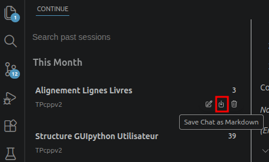

# TP / Atelier Pratique : Développement d'une Interface GUI Python et Coding Assisté par IA

**Environnement :** VS Codium + Extension Continue + Ollama (Gemma 4)

**Langages :** C++, Python (Tkinter)

---

## Évaluation

>[!warning] Attention
> **Votre historique git sera mon outil principale pour évaluer votre travail.** 
>
> C'est l'équivalent de votre rapport d'atelier, si ce n'est pas clair, la note sera mauvaise.

### Encadrement de l'IA générative

## Contexte & Objectif

Dans cet atelier, vous allez concevoir une **interface graphique (GUI) en Python avec customTkinter** permettant de remplacer l'interface en ligne de commande d'un programme du TP **C++**.

L'objectif second de cet atelier est d'apprendre à **collaborer efficacement avec un assistant de code IA** (LLM local/cloud via Continue) tout en conservant la maîtrise de votre projet, en gérant le contexte/tokens de manière responsable, et en appliquant de rigoureuses méthodologies de planification.

---

## Environnement de Travail & Configuration

### Outils requis

* **Éditeur :** VS Codium avec l'extension **Continue** installée.
* **Moteur LLM (Ollama) :**
* Modèle recommandé : **`gemma4:31bb-cloud`** (très performant et équilibré).
* *Alternatives :* `gemma4 36B` (puissant, plus gourmand) ou `gemma4 26B` (rapide et léger).

---

## Travail à Réaliser

### Phase 1 : Planification et Conception (`/docs`)

Avant d'écrire la moindre ligne de code, vous devez documenter votre démarche dans un dossier `docs/` à la racine de votre dépôt Git :

1. **Choix technique d'intégration :** Rédigez une courte analyse expliquant comment votre interface Python va communiquer avec la logique C++ (ex: sous-processus `subprocess`, wrappers, API C/C++, fichiers intermédiaires, etc.).
2. **Cahier des charges fonctionnel (`docs/fonctionnalites.md`) :** Listez l'ensemble des fonctionnalités que la GUI doit offrir par rapport au programme C++.
3. **Maquettage / Mockups (`docs/mockups/`) :** Réalisez des schémas visuels de l'interface (captures, dessins ou wireframes) pour guider le développement de l'UI (de nombreux modèles sont multi-modaux).

---

### Phase 2 : Développement de l'Interface GUI

* Coder l'interface customTkinter en Python en vous appuyant sur vos maquettes.
* Avancer par **petites étapes testables** (découper le problème en sous-composants).
* Valider le fonctionnement de l'interfaçage entre Python et la logique C++.

---

## Consignes & Bonnes Pratiques d'Utilisation de l'IA

> **Règle d'or :** L'IA est votre assitant, pas le developpeur principal. Ne déléguez pas 100 % du travail au LLM. Vous devez comprendre et être capable d'expliquer chaque ligne de code produite.

* **Traçabilité des échanges :**
* Exportez régulièrement vos sessions de chat Continue au format Markdown (`save chat as md`) et **commitez-les dans Git**.
> Dans le mode plein ecran du chat de continue :

* **Gestion optimale des tokens & du contexte :** Pensez à utiliser la commande **Compact session** ou à ouvrir une **nouvelle session** dès que vous changez de sujet ou de composant pour éviter de saturer la mémoire contextuelle.

* **Stratégie multi-modèles :** N'hésitez pas à alterner entre différents niveaux de LLM (SOTA, Open Weight, modèles plus légers) selon la complexité de la tâche (refactoring, génération de fonctions simple, documentation).

* **Versioning Git :** Effectuez des commits réguliers avec des messages clairs retraçant l'évolution du projet.

---

## Livrables Attendus

Un dépôt Git contenant :

* [ ] Le code source C++ original et le nouveau code Python (Tkinter).
* [ ] Le dossier `docs/` avec la documentation d'architecture, le cahier des charges `.md` et les mockups visuels.
* [ ] L'historique des échanges avec Continue (fichiers `.md` des chats). Dans un répertoire `chatsLogs`.
* [ ] Un historique de commits Git propre et régulier. 

