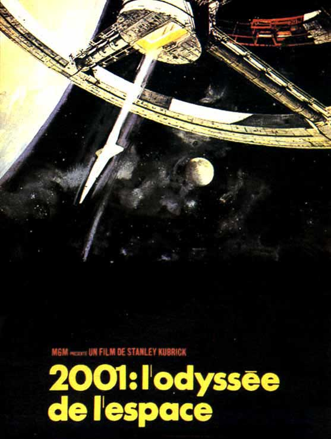
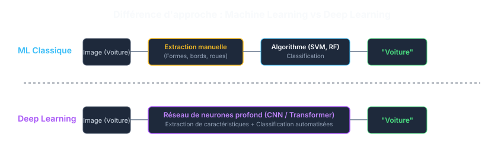
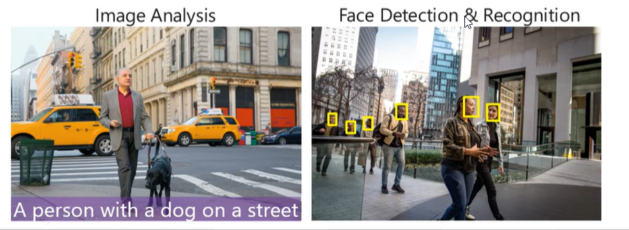
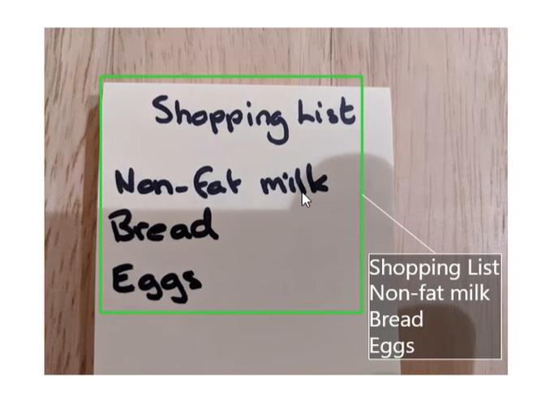

## Quotidien
Bien qu'aujourd'hui les termes **IA**, **IA générative** et **LLM** soient devenus quasi synonymes dans le grand public, l'IA couvre un champ d'application beaucoup plus large que les simples chatbots.

Chaque jour, vous interagissez avec une multitude d'algorithmes d'apprentissage automatique sans même vous en rendre compte.

Si on prend une journée « typique » :

### 6h00 : Réseaux sociaux & Fil d'actualité
* **TikTok, Instagram (Reels) et X (Twitter)** au réveil.
* Le succès de ces plateformes repose sur des systèmes de recommandation fondés sur l'apprentissage par renforcement.
* L'objectif : maximiser le temps d'écran (*engagement*) en prédisant exactement le contenu ou la publicité susceptible de capter votre attention.
* **Effets secondaires** : Création de bulles de filtres et de chambres d'écho algorithmiques.

### 7h00 : Transport & Déplacements
* **Transport en commun ?** 
  * Vous écoutez **Spotify** ou **Apple Music**, dont les modèles d'apprentissage continu créent des listes personnalisées (*Discover Weekly*) en analysant votre comportement et celui d'utilisateurs au profil similaire (*collaborative filtering*).
* **Voiture ?** 
  * **Google Maps** ou **Waze** calculent en temps réel le trajet optimal grâce à des algorithmes de prédiction de trafic alimentés par des données participatives (*crowdsourced*).
  * **Conséquence** : Redirection massive du trafic vers des rues résidentielles non prévues pour ce débit.
  * Au volant, vous dictez une destination à votre assistant (**Siri**, **Google Assistant**). Un modèle de reconnaissance vocale (*Automatic Speech Recognition*) transforme les ondes sonores en texte compréhensible par la machine.

### 12h00 : Photographie & Vision computationnelle
* **À la cafétéria** : Vous prenez une photo de votre plat pour la partager.
* Votre smartphone ajuste instantanément l'exposition, le contraste et le piqué grâce à la photographie computationnelle et à la détection de scène par IA.
* Plus tard, la reconnaissance faciale et sémantique dans **Google Photos** ou **Apple Photos** vous permet de chercher « Steeve » ou « pizza » pour retrouver l'image en un instant.

### 13h00 : Recherche de stage & Profilage
* Vous visitez **LinkedIn** pour dénicher un stage.
* Un algorithme de correspondance (*matching algorithm*) parcourt vos compétences et votre historique pour classer les offres les plus pertinentes.
* En arrière-plan, certains outils de RH filtrent automatiquement les CV avant même qu'un humain ne les lise.

### 14h30 : Cours au CÉGEP & Copilotes d'apprentissage
* **Cours de développement d'applications** : Coincé sur un bug dans votre code ?
* Vous sollicitez un copilote d'IA (**GitHub Copilot**, **ChatGPT**, **Claude**) intégré à votre environnement de développement (IDE) pour expliquer une erreur de syntaxe ou suggérer une refactorisation.

### 18h00 : Achats & Analyse comportementale
* **Passage au magasin ou en ligne** : Les caméras en magasin équipées de vision par ordinateur analysent les flux de circulation pour optimiser le placement des produits.
* **Commerce électronique** : L'analyse prédictive adapte les prix en temps réel (*dynamic pricing*) selon votre comportement d'achat et votre profil.
* *Anecdote historique classique* : Dès 2012, la chaîne Target avait prédit la grossesse d'une adolescente en analysant uniquement l'évolution de ses habitudes d'achat de produits de soins. [liens](https://www.forbes.com/sites/kashmirhill/2012/02/16/how-target-figured-out-a-teen-girl-was-pregnant-before-her-father-did/)

---

Dans cette journée, l'IA vous a permis de :
* **Prendre des décisions automatisées** basées sur des données historiques.
* **Traiter et interpréter un flux visuel ou sonore** en temps réel.
* **Générer du contenu synthétique** (texte, code, images).
* **Comprendre et structurer le langage naturel** écrit et parlé.

---

## Bref historique

<svg viewBox="0 0 800 480" xmlns="http://www.w3.org/2000/svg" style="width: 100%; height: auto; font-family: system-ui, -apple-system, sans-serif;">
  <rect width="800" height="480" fill="#0f172a" rx="12"/>
  
  <!-- Connecting Line -->
  <line x1="100" y1="60" x2="100" y2="420" stroke="#334155" stroke-width="4" stroke-dasharray="8 8"/>
  
  <!-- Era 1 -->
  <g transform="translate(100, 60)">
    <circle cx="0" cy="0" r="12" fill="#3b82f6"/>
    <rect x="40" y="-35" width="620" height="70" fill="#1e293b" rx="8" stroke="#3b82f6" stroke-width="1.5"/>
    <text x="60" y="-10" fill="#60a5fa" font-weight="bold" font-size="14">1950s - 1980s : IA Symbolique &amp; Systèmes Experts</text>
    <text x="60" y="15" fill="#94a3b8" font-size="13">Règles logiques formelles codées à la main ("Si... Alors...")</text>
  </g>
  
  <!-- Era 2 -->
  <g transform="translate(100, 180)">
    <circle cx="0" cy="0" r="12" fill="#06b6d4"/>
    <rect x="40" y="-35" width="620" height="70" fill="#1e293b" rx="8" stroke="#06b6d4" stroke-width="1.5"/>
    <text x="60" y="-10" fill="#22d3ee" font-weight="bold" font-size="14">1990s - 2000s : Machine Learning Classique</text>
    <text x="60" y="15" fill="#94a3b8" font-size="13">Algorithmes statistiques apprenant à partir de données (SVM, Random Forest)</text>
  </g>
  
  <!-- Era 3 -->
  <g transform="translate(100, 300)">
    <circle cx="0" cy="0" r="12" fill="#8b5cf6"/>
    <rect x="40" y="-35" width="620" height="70" fill="#1e293b" rx="8" stroke="#8b5cf6" stroke-width="1.5"/>
    <text x="60" y="-10" fill="#a78bfa" font-weight="bold" font-size="14">2010s : Deep Learning (Apprentissage Profond)</text>
    <text x="60" y="15" fill="#94a3b8" font-size="13">Réseaux de neurones profonds, explosion des GPU &amp; Big Data</text>
  </g>
  
  <!-- Era 4 -->
  <g transform="translate(100, 420)">
    <circle cx="0" cy="0" r="12" fill="#ec4899"/>
    <rect x="40" y="-35" width="620" height="70" fill="#1e293b" rx="8" stroke="#ec4899" stroke-width="1.5"/>
    <text x="60" y="-10" fill="#f472b6" font-weight="bold" font-size="14">2020s+ : IA Générative, Transformers &amp; Agents</text>
    <text x="60" y="15" fill="#94a3b8" font-size="13">LLMs, Multimodalité, Raisonnement avancé et systèmes agentiques</text>
  </g>
</svg>

---

## Définition

Définir avec exactitude l’intelligence artificielle reste un exercice complexe en raison de la vitesse à laquelle les capacités technologiques évoluent.

On peut la définir rigoureusement ainsi :

> **L'intelligence artificielle (IA)** désigne l'ensemble des théories, méthodes et techniques visant à concevoir des machines et des systèmes informatiques capables de simuler des fonctions cognitives associées à l'intelligence humaine — telles que l'apprentissage, le raisonnement, la perception, la résolution de problèmes complexes et la prise de décision.
>
> [Wikipedia](https://fr.wikipedia.org/wiki/Intelligence_artificielle)

Les contours de cette définition restent mouvants, car la notion même d'« intelligence humaine » fait l'objet de débats en sciences cognitives et en philosophie.

Le débat s'intensifie lorsqu'on aborde la notion d'**Intelligence Artificielle Générale (IAG / AGI)** ou de conscience artificielle. N'ayant pas de consensus scientifique sur la nature exacte de la conscience chez l'humain ou l'animal, évaluer si une architecture logicielle peut développer une forme d'intentionnalité ou de conscience demeure un enjeu ouvert.

---

## Mesurer l'intelligence artificielle

L'évaluation de la performance d'un modèle est indissociable de son développement. Selon la tâche (classification, régression, génération), on utilise des métriques précises (*exactitude, F1-score, perplexité, benchmarks de raisonnement*).

### Le test de Turing
Proposé par **Alan Turing en 1950** sous le nom de « Jeu de l'imitation », ce test évalue si une machine peut soutenir une conversation textuelle au point qu'un juge humain ne puisse la distinguer d'un autre être humain.

Aujourd'hui, les modèles de langage modernes passent le test de Turing dans de nombreux scénarios conversationnels courts. Cependant, cela ne prouve pas une « intelligence réelle », mais plutôt une capacité exceptionnelle à imiter les structures statistiques du langage humain.

### La Singularité technologique

> « La singularité technologique désigne l'hypothèse selon laquelle la création d'une intelligence artificielle surhumaine déclencherait une réaction en chaîne d'auto-amélioration, entraînant un emballement technologique et des transformations imprévisibles pour la civilisation humaine. »

Bien que les progrès récents soient majeurs, le consensus scientifique rappelle que **l'augmentation brute de la taille des modèles (scaling laws) rencontre des limites physiques, énergétiques et de disponibilité de données de qualité**. Créer des systèmes plus performants nécessite de nouvelles architectures et méthodes de raisonnement, et non une simple expansion des modèles existants.

---

## Domaines principaux de l'IA

| Domaine | Description |
| :--- | :--- |
| **Apprentissage machine (*Machine Learning*)** | Détection de motifs et modèles prédictifs basés sur l'analyse de données. |
| **Vision par ordinateur (*Computer Vision*)** | Extraction, analyse et compréhension d'informations à partir d'images ou de vidéos. |
| **Traitement automatique des langues (*NLP*)** | Analyse, traduction, compréhension et génération du langage humain écrit ou parlé. |
| **IA Générative & Modèles Multimodaux** | Création autonome de texte, code, audio, images ou vidéos à partir de requêtes (*prompts*). |
| **Systèmes autonomes & Agents** | Prise de décision et exécution de séquences d'actions complexes de manière autonome dans un environnement défini. |

### Réussites scientifiques majeures de l'IA

* **Biologie structurale & Santé** : **AlphaFold** (Google DeepMind) a résolu le problème fondamental du repliement des protéines en 3D, accélérant massivement la compréhension du vivant et le développement de traitements ciblés.
* **Découverte de matériaux & Médicaments** : Des réseaux neuronaux prédisent la stabilité de millions de molécules, permettant la découverte de nouveaux antibiotiques et de matériaux pour les batteries de nouvelle génération.
* **Physique & Énergie** : Contrôle du plasma à haute température dans les réacteurs à fusion nucléaire (*tokamaks*) via l'apprentissage par renforcement profond.
* **Astrophysique** : Traitement massif de données téléscopiques pour la détection d'exoplanètes, la cartographie de la matière noire et la reconstruction d'images de trous noirs (*Event Horizon Telescope*).
* **Météorologie & Climat** : Des modèles comme **GraphCast** réalisent des prévisions météorologiques globales à moyenne échéance plus précises et des milliers de fois plus rapides que les modèles numériques traditionnels.
* **Mathématiques & Logique** : Assistance à la preuve formelle et découverte autonome de nouvelles conjectures en théorie des nœuds et en algèbre matricielle.

---

## Défis et enjeux de l'intelligence artificielle

L'intégration de l'IA dans des systèmes critiques pose des défis éthiques, techniques et sociétaux :

* **Biais et équité (*Bias & Fairness*)** : Si les données d'entraînement reflètent des stéréotypes ou des inégalités historiques, le modèle reproduira et amplifiera ces biais (ex. tri de CV, attribution de crédits, justice prédictive).
* **Hallucinations & Fiabilité** : Les modèles génératifs peuvent affirmer avec assurance des faits totalement erronés. La vérifiabilité reste un enjeu majeur.
* **Confidentialité & Sécurité des données** : L'entraînement nécessite d'immenses volumes de données, posant des risques de fuite d'informations personnelles, de secrets industriels ou de propriété intellectuelle.
* **Explicabilité & Effet « Boîte Noire » (*XAI*)** : Comprendre *pourquoi* un réseau profond a pris une décision spécifique est très complexe, ce qui pose problème en médecine, en aviation ou dans le domaine juridique.
* **Alignement & Autonomie des agents** : S'assurer que les objectifs optimisés par un agent autonome correspondent exactement aux intentions et valeurs humaines sans effets secondaires indésirables (*Agentic Misalignment*). [Risque d'un mauvais alignement.](https://www.anthropic.com/research/agentic-misalignment)
* **Impact environnemental & Souveraineté** : L'entraînement et l'inférence des grands modèles consomment d'immenses quantités d'électricité et d'eau (refroidissement des centres de données), posant la question de l'empreinte carbone et du contrôle des infrastructures.

---

## Les données : le carburant de l'IA

Une **donnée** est une représentation symbolique (numérique, textuelle, visuelle) d'une information, stockée et exploitable par un système informatique.

### Typologie des données
* **Données structurées** : Bases de données relationnelles, fichiers CSV, tables SQL (ex. historiques de transactions, relevés de notes).
* **Données non structurées** : Textes bruts, images, fichiers audio, flux vidéo (représentent plus de 80 % des données produites mondialement).
* **Données semi-structurées** : Documents JSON, XML, logs systèmes.

### Du Big Data à la qualité des données (*Data-Centric AI*)
Pendant longtemps, le paradigme du **Big Data** (défini par les 3V : *Volume, Variété, Vélocité*) privilégiait la quantité. Aujourd'hui, l'accent est mis sur la **qualité des données** (*Data-Centric AI*) : nettoyer, annoter et débiaiser les ensembles de données est souvent plus déterminant pour la performance d'un modèle que la simple augmentation de sa taille.

<svg xmlns="http://www.w3.org/2000/svg" viewBox="0 0 850 200" style="background: #0f172a; border-radius: 12px; font-family: system-ui, -apple-system, sans-serif;">
  <text x="425" y="30" text-anchor="middle" fill="#f8fafc" font-size="16" font-weight="700">Le Pipeline de Traitement des Données en IA</text>

  <!-- Step 1 -->
  <g transform="translate(30, 60)">
    <rect width="160" height="90" rx="8" fill="#1e293b" stroke="#38bdf8" stroke-width="1.5"/>
    <text x="80" y="35" text-anchor="middle" fill="#38bdf8" font-size="13" font-weight="600">1. Collecte Brute</text>
    <text x="80" y="55" text-anchor="middle" fill="#94a3b8" font-size="11">Web Scraping, Logs,</text>
    <text x="80" y="70" text-anchor="middle" fill="#94a3b8" font-size="11">Capteurs, CSV, Images</text>
  </g>

  <!-- Arrow -->
  <path d="M 200 105 L 225 105" stroke="#64748b" stroke-width="2" fill="none" marker-end="url(#arrow)"/>

  <!-- Step 2 -->
  <g transform="translate(235, 60)">
    <rect width="160" height="90" rx="8" fill="#1e293b" stroke="#fbbf24" stroke-width="1.5"/>
    <text x="80" y="35" text-anchor="middle" fill="#fbbf24" font-size="13" font-weight="600">2. Nettoyage</text>
    <text x="80" y="55" text-anchor="middle" fill="#94a3b8" font-size="11">Filtrage du bruit,</text>
    <text x="80" y="70" text-anchor="middle" fill="#94a3b8" font-size="11">Anonymisation, Dédoublonnage</text>
  </g>

  <!-- Arrow -->
  <path d="M 405 105 L 430 105" stroke="#64748b" stroke-width="2" fill="none"/>

  <!-- Step 3 -->
  <g transform="translate(440, 60)">
    <rect width="160" height="90" rx="8" fill="#1e293b" stroke="#a855f7" stroke-width="1.5"/>
    <text x="80" y="35" text-anchor="middle" fill="#c084fc" font-size="13" font-weight="600">3. Vectorisation</text>
    <text x="80" y="55" text-anchor="middle" fill="#94a3b8" font-size="11">Conversion en nombres</text>
    <text x="80" y="70" text-anchor="middle" fill="#94a3b8" font-size="11">(Embeddings [0.12, -0.98...])</text>
  </g>

  <!-- Arrow -->
  <path d="M 610 105 L 635 105" stroke="#64748b" stroke-width="2" fill="none"/>

  <!-- Step 4 -->
  <g transform="translate(645, 60)">
    <rect width="170" height="90" rx="8" fill="#1e293b" stroke="#4ade80" stroke-width="1.5"/>
    <text x="85" y="35" text-anchor="middle" fill="#4ade80" font-size="13" font-weight="600">4. Entraînement</text>
    <text x="85" y="55" text-anchor="middle" fill="#94a3b8" font-size="11">Calcul de poids &amp;</text>
    <text x="85" y="70" text-anchor="middle" fill="#94a3b8" font-size="11">Ajustement du modèle</text>
  </g>
</svg>

---

## Machine Learning vs Deep Learning

<svg viewBox="0 0 800 420" xmlns="http://www.w3.org/2000/svg" style="width: 100%; height: auto; font-family: system-ui, -apple-system, sans-serif;">
  <rect width="800" height="420" fill="#0f172a" rx="12"/>
  
  <!-- Outer Box: AI -->
  <rect x="20" y="20" width="760" height="380" fill="#1e293b" fill-opacity="0.5" stroke="#3b82f6" stroke-width="2" rx="10"/>
  <text x="40" y="55" fill="#60a5fa" font-weight="bold" font-size="18">INTELLIGENCE ARTIFICIELLE</text>
  <text x="40" y="80" fill="#94a3b8" font-size="13">Tout système simulant une forme d'intelligence ou de cognition.</text>
  
  <!-- Middle Box: ML -->
  <rect x="50" y="110" width="700" height="270" fill="#0f172a" fill-opacity="0.7" stroke="#06b6d4" stroke-width="2" rx="8"/>
  <text x="70" y="145" fill="#22d3ee" font-weight="bold" font-size="16">MACHINE LEARNING (Apprentissage Automatique)</text>
  <text x="70" y="170" fill="#94a3b8" font-size="13">L'algorithme apprend à partir de données sans être explicitement programmé.</text>
  
  <!-- Inner Box: DL -->
  <rect x="80" y="200" width="640" height="150" fill="#1e1b4b" fill-opacity="0.9" stroke="#8b5cf6" stroke-width="2" rx="6"/>
  <text x="100" y="235" fill="#a78bfa" font-weight="bold" font-size="15">DEEP LEARNING (Apprentissage Profond)</text>
  <text x="100" y="260" fill="#c4b5fd" font-size="13">Réseaux de neurones profonds capables d'extraire automatiquement</text>
  <text x="100" y="280" fill="#c4b5fd" font-size="13">des représentations et caractéristiques complexes.</text>
</svg>

### Machine Learning (ML classique)
L'ingénieur doit souvent extraire manuellement les caractéristiques pertinentes (*feature engineering*) avant de les transmettre à un algorithme classique (Régression logistique, Arbres de décision, Forêts aléatoires, SVM).

### Deep Learning (DL)
Repose sur des architectures en réseaux de neurones artificiels comportant de nombreuses couches cachées. Le modèle apprend **directement et de manière hiérarchique** à extraire les caractéristiques pertinentes à partir des données brutes (pixels, ondes sonores, tokens de texte).

---

## Traitement automatique des langues (NLP) & Vision par ordinateur

### Vision par ordinateur (*Computer Vision*)

Permet aux machines d'analyser et de comprendre le contenu visuel.
* **Applications clés** :
  * **Classification d'images** : Identifier la catégorie principale d'une image.
  * **Détection d'objets** : Localiser et entourer (*bounding box*) plusieurs objets dans une scène (ex. véhicules autonomes).
  * **Segmentation** : Isoler chaque pixel appartenant à une classe spécifique (ex. imagerie médicale pour délimiter une tumeur).

### Traitement automatique des langues (*NLP*)

Permet aux machines de lire, interpréter, traduire et générer le langage humain.

* **Applications clés** :
  * **Analyse de sentiment** : Déterminer la polarité (positive/négative) d'un avis client.
  * **Traduction automatique** : Passage fluide d'une langue à une autre.
  * **Extraction d'information & Résumé** : Syntétiser de longs documents ou en extraire des entités nommées (dates, lieux, personnes).
  * **Génération de texte & Modèles de fondation** : Compréhension contextuelle avancée et dialogue interactif.

---
Illustrations svg générées par gemini