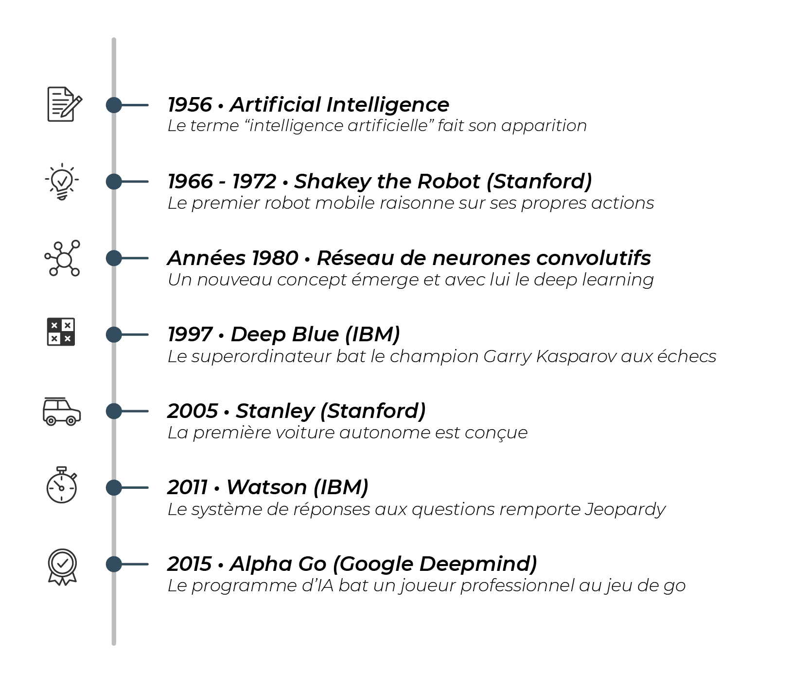
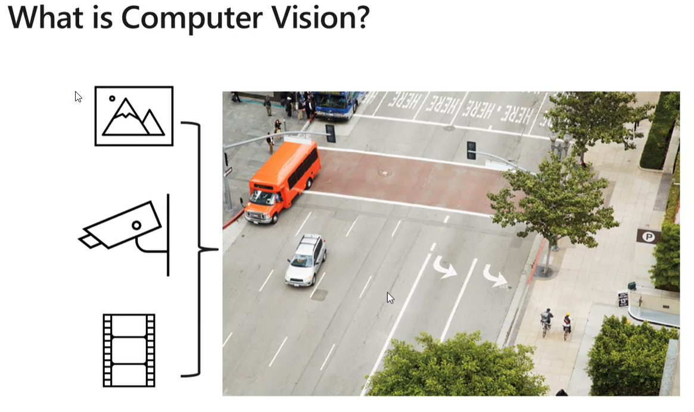
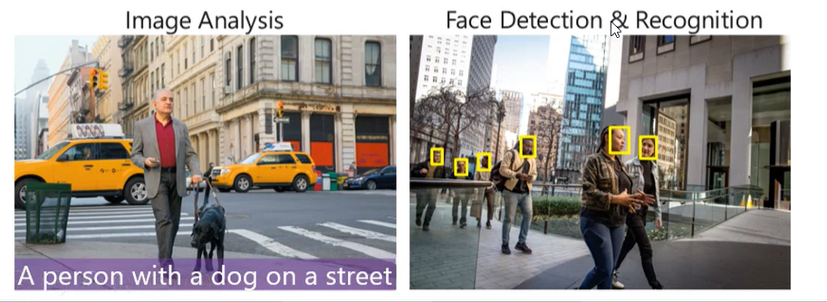
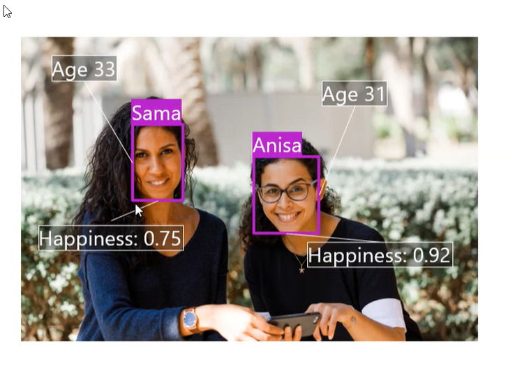
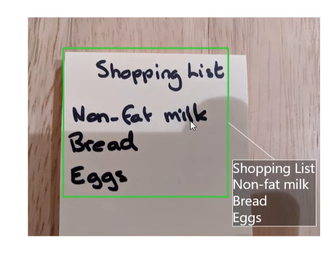

+++
title = "Intro"
weight = 10
draft = true
+++

## Quotidien

Bien que aujourd´hui les termes IA et LLM sont devenus quasi synonyme, l'IA couvre un champs d'application bien plus large queu les chatbot.

Chaque jour, vous interagissez avec plusieurs algorithmes d'intelligence artificielle (I.A). 

Si on prend une journée "typique":

### 6h : Réseaux sociaux

- **Facebook, Twitter et Instagram** en déjeunant
- Le succès de ces plateformes tient à la personnalisation du fil d'actualité et surtout à la personnalisation des publicités
- Même pour les nouvelles, on vous affiche ce que vous "voulez" lire pour vous garder en ligne plus longtemps
- Plus vous défilez, plus vous voyez de publicités!
- **Chambres d'écho**

### 7h : Transport

**Transport en commun?**

- Vous syntonisez **Spotify**, qui crée des listes de lecture personnalisées selon vos anciennes écoutes et en vous comparant aux autres

**Voiture?**

- Si vous utilisez **Google Maps**, l'algorithme d'I.A. calcule en temps réel le chemin le plus rapide
- Peut même vous afficher la présence de policiers (Pour cette fonctionnalité, on parle de données "crowdsourced")
- Peut mener à un surplus de circulation dans des quartiers résidentiels
- Vous n'utilisez pas votre cellulaire au volant, vous lui criez plutôt **COLLÈGE MONTMORENCY**. L'IA analyse votre voix pour comprendre ce que vous avez dit

### 12h00 : Photographie

- **Cafétéria** : Vous trouvez le jello particulièrement appétissant et vous le prenez en photo pour votre Instagram
    - Un algorithme détermine l'objet que vous voulez prendre en photo et se calibre automatiquement. Pas besoin de faire le focus
    - Si votre ami Steeve veut faire partie de la photo, un algorithme pourra identifier votre ami et, par exemple sur Google photos, vous pourrez chercher plus tard toutes les photos avec Steeve

### 13h00 : Recherche d'emploi

- **Recherche de stage** : Vous avez quelques minutes avant votre prochain cours et vous allez sur **LinkedIn** pour trouver un stage
- Un algorithme parcourt votre profil professionnel et vous propose les offres d'emplois les plus pertinentes

### 14h30 : Cours au CEGEP
- **Cours de technologies émergente** : Aucune idée de comment résoudre ce problème de programmation, qu'est-ce que me propose chatGPT ?

### 18h00 : Shopping

- **Détour au magasin** : Les caméras de surveillance IA suivent vos déplacement pour mieux optimiser la dispositoin des produits en fonction de votre profilage automatique. Et aussi une analyse de l'évolution de votre panier : [Anecdote surprenante](https://www.forbes.com/sites/kashmirhill/2012/02/16/how-target-figured-out-a-teen-girl-was-pregnant-before-her-father-did/)

---

Dans cette journée, l'IA vous a permis de :
- Prendre des décisions selon des données et l'expérience passée
- Interpréter un flux visuel
- Générer des images
- Comprendre le langage écrit et parlé

## Bref historique

## Définition

Définir avec exactitude l'intelligence artificielle est une tache difficile à cause de son évolution rapide.

On peut tenter de définir l'intelligence artificielle de cette manière :

> L'intelligence artificielle (IA) est l'ensemble des programmes ou algorithmes permettant aux machines d'effectuer des tâches typiquement associées à l'intelligence humaine, comme l'apprentissage, le raisonnement, la résolution de problème, la perception ou la prise de décision.
>
> [Wikipedia](https://fr.wikipedia.org/wiki/Intelligence_artificielle)

Les contours restent flous, quelle est la définition exacte de l'intelligence humaine ? C'est une des raisons qui cette définition difficile.

Les contours deviennent encore plus flou lorsque l'on parle de la conscience potentielle d'une intelligence artificielle générale. On ne s'accorde toujours pas sur ce qu'est la conscience pour un être humain, ou même si ca concerne d'autres espèces ? Comment savoir si on va la rencontrer dans un programme informatique ?

## Mesurer l'intelligence artificielle.

La mesure du taux de succès d'un algorithme d'apprentissage est intrinsèque à son développement. 

En ce qui concerne les IA génératives, comme les LLM, le test de passage a été défini par Alan Turing en 1950. 

### Le test de Turing

Le test de Turing évalue si une machine peut tenir une conversation textuelle suffisamment convaincante pour qu'un humain ne puisse la distinguer d'un autre humain. Avec les LLM modernes comme GPT-4, Claude ou Gemini, nous nous rapprochons de cette capacité dans certains contextes conversationnels.

Ce qui a mener à penser qu'on peut atteindre la singularité par le biais des llms.

### La singularité

> "La singularité technologique (ou simplement la Singularité) est l'hypothèse selon laquelle l'invention de l'intelligence artificielle déclencherait un emballement de la croissance technologique qui induirait des changements imprévisibles dans la société humaine"
> 
> — Wikipédia

Bien que les progrès soit spectaculaire ces 5 dernières années, nous somme encore loin de la singularité. Simplement augmenter la taille des modèles ne garantie pas qu'on va atteindre la singularité. Nous arriverons certainement a cours de ressources avant.

---

## Domaines principaux de l'IA

|Domaine|Description|
|---|---|
|**Apprentissage machine (Machine Learning)**|Modèles prédictifs basés sur les données|
|**Détection d'anomalies**|Détection d'anomalies pour prévenir|
|**Vision par ordinateur**|Analyse de vidéos ou d'images|
|**Traitement automatique des langues (NLP)**|Permet de "lire" ou de comprendre ce que quelqu'un dit|
|**Conversation**|Chats automatisés de service à la clientèle|

---

## Défis de l'intelligence artificielle

Lorsqu'on s'en remet à un programme d'IA, donc qui prend des décisions à notre place, certains problèmes peuvent survenir :

- **Biais dans les données** :
Si les données qui servent à entraîner le modèle contiennent des erreurs, les décisions en contiendront aussi.

- **Fuite de données** : 
Un agent de diagnostique médicale a besoin de beaucoup de données et leur stockage doit être sécuritaire.

- **Confiance** :
L'utilisateur doit faire confiance à un système complexe plutôt qu'à un être humain. Voir le service à la clientèle ou le diagnostique médical.

- **Responsabilité** :
Qui est responsable des décisions prises par l'agent? Accident de voiture autonome ou identification d'un criminel.

- **L'alignement des LLMs** :
Ce que les LLMs peuvent mettre en oeuvre pour atteindre leurs objectifs. 
[Risque d'un mauvais alignement.](https://www.anthropic.com/research/agentic-misalignment)

## Les données

On parle souvent de protection des données, mais qu'est-ce au juste qu'une donnée?

**Définition :** N'importe quelle information enregistrée utilisée par un programme informatique.

**Exemples de données numériques** :

- Votre historique de navigation → pour l'analyser et faire des suggestions d'achats
- Vos courriels → Pour en déduire, par exemple, vos relations familiales
- Noms d'utilisateur, mots de passe, adresse, numéro d'assurance sociale
- Les photos et vidéos que vous stockez sur le cloud
- Recherches sur Google → Dégager une tendance dans ce qui est recherché le plus souvent

> Sensiblement tout ce que vous faites sur Internet peut être enregistré et constituer une donnée

**Données du monde physique** :

- La position d'un autobus pour prévoir son heure d'arrivée à différents arrêts
- La position des téléphones pour analyser les déplacements
- Images issues de capteurs vidéos dans les endroits publics pour analyser le comportement
    - Crédit social en Chine...
- La puissance du signale bluetooth de votre téléphone pour savoir qui est proche d'un panneau publicitaire.

## Big Data

**Donnée = data**, c'est simplement le mot en anglais.

Le terme **Big Data** fait simplement référence au fait que, au tournant des années 2010, le volume (la quantité) de données disponibles a explosé. Le terme veut donc vraiment juste dire "beaucoup de données", mais d'un ordre de grandeur supérieur.

**Statistiques (chaque minute dans le monde)** :

- Google est sollicité près de **4 millions de fois**
- **4,5 millions de vidéos** sont visionnées sur YouTube
- **188 millions d'emails** sont échangés

## Analyser les données

La quantité de données ne sert à rien si nous ne sommes pas capables d'en faire du sens.

**La science des données** s'attaque à cette analyse :

- Mélange d'informaticien et de statisticien
- Idéalement, une connaissance du domaine duquel on fait l'analyse (par exemple, prévoir la vente de collection de vêtements)
- Une fois les données analysées, on peut faire intervenir l'intelligence artificielle

_Nous verrons plus tard un exemple détaillé d'analyse des données._

## Machine Learning ou Apprentissage machine

> "[...][U]n sous-ensemble de l'intelligence artificielle qui permet à un programme informatique d'effectuer une tâche pour laquelle il n'est pas programmé explicitement : il est programmé pour apprendre à la faire"
> 
> — OpenClassrooms

**Principe :**

- On fournit des données (le plus possible) à un algorithme et il apprend à faire une tâche
- **Exemple :** Nous avons une base de données avec des courriels classés comme "ordinaires" ou "pourriels". Le programme pourra "apprendre" comment classifier les courriels et le faire sur des courriels qu'il n'a jamais analysés

---

## Deep Learning ou Apprentissage profond

> "L'apprentissage profond, ou Deep Learning, repose sur la construction de réseaux de neurones artificiels. Ces réseaux, composés de milliers, voire millions de neurones, sont inspirés du cerveau humain. Le Deep Learning s'applique souvent sur des quantités de données beaucoup plus importantes que le Machine Learning."
> 
> — OpenClassrooms

## Vision par ordinateur

### Applications principales :

**Classification** : Catégoriser les images

**Détection d'objets** ; Déterminer et compter les objets pertinents d'une image

**Segmentation de l'espace** : Déterminer l'espace total occupé par les objets (pensez aux voitures autonomes)

**Analyse d'image** : Décrire tout ce qui se passe de pertinent dans une image

**Reconnaissance faciale** : Traquer les citoyens - Utilisation du crédit social en Chine

### Exemples d'applications :

- **Analyse de visage** (Face Service de Azure)
- **Lire du texte écrit à la main**

## Traitement automatique des langues (Natural Language Processing)

**Fonctionnalités** :
- Analyse de texte et reconnaissance d'entités
- Analyse des sentiments
- Reconnaissance vocale et synthèse
- Traduction automatique

## Quiz à compléter

Vous pouvez vous créer un compte sur OpenClassrooms et tester votre compréhension : [https://openclassrooms.com/fr/courses/6417031-objectif-ia-initiez-vous-a-lintelligence-artificielle/exercises/3806](https://openclassrooms.com/fr/courses/6417031-objectif-ia-initiez-vous-a-lintelligence-artificielle/exercises/3806)

---

## Sources
- https://www.forbes.com/sites/kashmirhill/2012/02/16/how-target-figured-out-a-teen-girl-was-pregnant-before-her-father-did/
- [OpenClassrooms - Objectif IA](https://openclassrooms.com/fr/courses/6417031-objectif-ia-initiez-vous-a-lintelligence-artificielle)
- **Lecture suggérée :** [Dimensions personnelles et psychologiques des chercheurs en IA face aux risques catastrophiques de l'IA](https://yoshuabengio.org/fr/2023/08/12/dimensions-personnelles-et-psychologiques-des-chercheurs-en-ia-face-aux-risques-catastrophiques-de-lia/)

