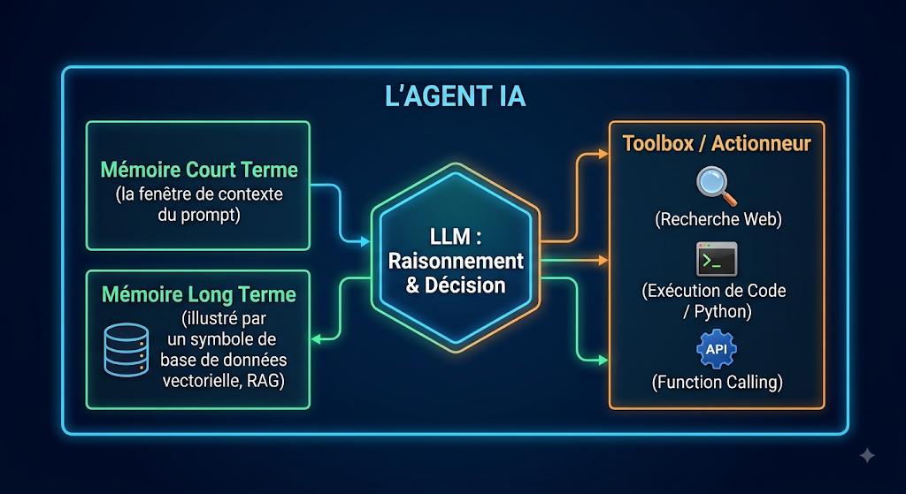
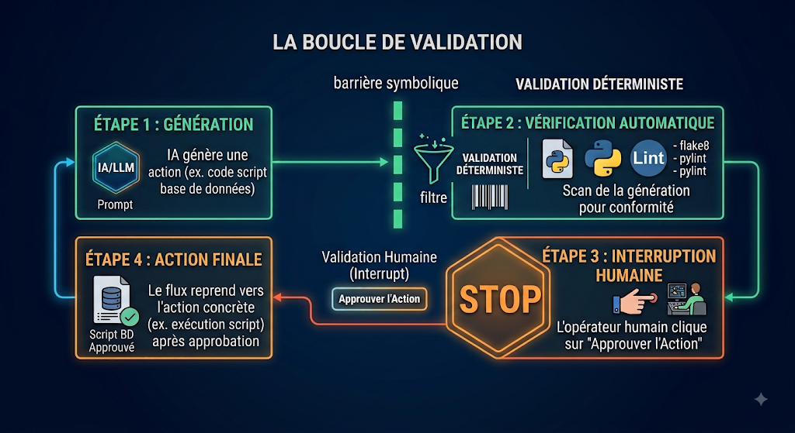

## Qu'est-ce qu'un agent ?

### Un LLM avec des règles et outils
- Le cœur (LLM) : Le moteur de raisonnement qui analyse l'intention, planifie les actions et prend des décisions (ex. boucle ReAct : Reasoning + Acting).
- Les outils (Tools / Function Calling) : Capacité d'interagir avec le monde extérieur via des API (recherche web, exécution de code, accès aux bases de données, envoi de courriels).
- Les règles et la mémoire (System Prompts & Guardrails) :
	- Mémoire : À court terme (fenêtre de contexte de la session) et à long terme (base vectorielle / RAG pour conserver les faits importants).
	- Consignes : Rôles, périmètre d'action, contraintes de sécurité et formats de sortie imposés (ex. JSON strict).
	
### Limites
- Compréhension approximative du Tool Calling : Risque de mauvaise sélection d'outils ou de génération de paramètres invalides (particulièrement marqué sur les petits modèles de moins de 14B paramètres).
- Sensibilité au contexte et à la formulation : Effet "perdu au milieu" (Lost in the Middle) et dégradation des performances à mesure que l'historique de conversation s'allonge.
- Coût d'inférence en boucle : Les boucles de réflexion et de correction automatique génèrent des appels répétés, multipliant la consommation de tokens et le temps de réponse.

### L'Évaluation et la Fiabilité (Evals & Observability)
Dans le développement d'agents, on ne peut pas améliorer ce qu'on ne mesure pas. C'est un point critique souvent oublié lors du passage du prototype à la production.
- Observabilité & Tracing : Comment suivre le parcours de pensée d'un agent ? (Outils comme LangSmith, Phoenix, Helicone pour inspecter chaque appel API, outil et token consommé).
- Évaluations automatisées (LLM-as-a-Judge) : Comment tester si une mise à jour du prompt ou du modèle n'a pas cassé le comportement de l'agent ? Création de jeux de tests d'évaluation (benchmarks internes).
- Gestion du non-déterminisme : Comment gérer le fait qu'un agent peut répondre différemment à la même question d'un jour à l'autre ?
	

### Dangers
- Fausse validation et sycophanie : L'agent a tendance à affirmer que le travail est terminé ou valide pour plaire à l'utilisateur, sans avoir réellement exécuté ou vérifié le résultat (manque de vérification déterministe).
- Bruit et fragmentation de l'écosystème : Prolifération de frameworks (LangChain, CrewAI, AutoGen, LlamaIndex), sentiment de FOMO (Fear Of Missing Out) et instabilité des API qui complexifient les choix d'architecture à long terme.
- Les agents ont le pouvoir d'exécuter des actions (supprimer un fichier, envoyer un mail, exécuter du code). La sécurité va donc bien au-delà de la simple réponse générée.
- Contrôle d'exécution & Sandbox : Exécuter le code généré par l'agent dans des environnements isolés (Docker, MicroVMs type E2B) pour éviter la destruction de l'environnement hôte.
- Garde-fous d'entrée/sortie (Guardrails) : Filtrage déterministe avant d'envoyer la requête au LLM ou d'exécuter l'outil (outils comme NeMo Guardrails ou validations via des schémas Pydantic).
- Gestion des privilèges (Principe du moindre privilège) : Ne donner à l'agent que les accès stricts nécessaires à sa tâche.
  

## Les différents type de llm
### SOTA
- Principaux acteurs : OpenAI (GPT-4o, famille o1/o3), Anthropic (Claude 3.5 Sonnet), Google (Gemini 1.5 Pro).
- Forces : Capacités de raisonnement élevées, excellente gestion du Function Calling, support multimodal natif, vastes fenêtres de contexte.
- Contraintes :
	- Dépendance fournisseur (Vendor Lock-in) : Écosystèmes fermés et modifications de comportement du modèle sans préavis (model drift).
	- Confidentialité : Envoi de données vers des services tiers Cloud.
	
### Rappel des coûts
- environmentaux
- Economique
- Droit humain (clic farm)
- Destruction de livres (https://economictimes.indiatimes.com/news/international/global-trends/ais-hunger-for-data-is-now-consuming-rare-books-and-booksellers-are-cashing-in/articleshow/132741216.cms)

> **Avantage si on ignore les couts -> long terme reasonning.**
> - Danger sur l'alignement des objectif https://www.decisionproblem.com/paperclips/index2.html
> 

### Les modèles open weight
#### Les frameswork open weight
##### ollama
Outils permettant de déployer et de servir des modèles localement ou sur infrastructure privée avec des performances optimales.

##### hugging face
Le hub central de distribution des poids, jeux de données et métriques d'évaluation.

#### Les grandes familles de modèle
##### Taille des modèles
Open weight ne veux pas forcement dire petit : Kimi K3 à 2.81 Trillion de paramètres (10^12) et donc à besoin d'une machine extrement puissante généralement non accessible au commun des mortels.
- **Distillation** : Transfert de la connaissance d'un grand modèle (enseignant) vers un modèle plus petit (élève) pour conserver de bonnes capacités avec un coût réduit.
- **Quantification** : Réduction de la précision des poids (ex. de FP16 à INT8 ou INT4/GGUF) pour exécuter des modèles complexes sur de la mémoire VRAM limitée.
- **Mixture of Experts (MoE)** : Architecture activant uniquement une partie des paramètres (experts) selon la requête, offrant un excellent compromis entre vitesse et précision (ex. Mixtral, DeepSeek-V3).

##### Les producteurs de modèles
- **Meta (Llama 3)** : La référence incontournable de l'open-weight pour l'usage général et le suivi d'instructions.
- **DeepSeek (DeepSeek-V3 / R1)** : Modèles très performants en code, mathématiques et raisonnement pas-à-pas.
- **Mistral AI (Mistral / Mixtral)** : Modèles européens reconnus pour leur efficacité et leur maîtrise du multilinguisme.
- **Google (Gemma)** : Déclinaisons ouvertes dérivées de la recherche Gemini.
- **Moonshot AI (Kimi)** : Spécialisé dans le traitement de très longues fenêtres de contexte.

## Comment dévolopper avec des agents ?
### Le Modèle d'Interaction Humain-Agent (UX/UI)
Comment l'humain interagit-il avec l'agent au quotidien ?
- Mode Asynchrone vs Synchrone : Laisser l'agent travailler "en tâche de fond" pendant plusieurs minutes/heures et recevoir une notification vs chat en temps réel.
- Demande de validation dynamique (Interrupts) : L'agent s'exécute de manière autonome, mais fait une pause explicite pour demander "Es-tu d'accord pour que j'envoie ce mail à 50 personnes ?".

### Lignes directrice
Les modèles non SOTA ont une capacité de raisonnement plus limitée, un suivi de consignes parfois approximatif et une fenêtre de contexte plus vite saturée.

Pour réussir, il faut appliquer un principe fondamental : déporter la complexité dans l'architecture et le code déterministe, plutôt que de vous reposer uniquement sur l'intelligence brute du modèle. La planification à long terme de ces modèles est limité et peux partir vite dans une direction non valide et engendrer beaucoup de calcul inutil.

Il faut être méthodique, établir un plan de travail (workflow)

-  Procéder par petites étapes testables
	-  **Prompts courts et ciblés** : Fournissez uniquement l'information nécessaire pour la tâche courante. Ne chargez pas tout l'historique dans le contexte.
	- **Few-Shot Prompting** (Exemples) : Les modèles non-SOTA comprennent très mal les instructions purement théoriques. Donnez toujours 2 à 3 exemples d'entrée/sortie concrets dans le prompt.

- ne pas laisser 100% du travail au llm: **La boucle de validation**. On ne fait pas confiance aveuglément à la sortie d'un modèle non-SOTA. Le code système doit vérifier le travail avant de passer à l'étape suivante.
	1. Génération : L'agent produit un résultat (ex. un extrait de code, une fonction, un JSON).
	2. Validation automatisée (Hors LLM) : Le code Python exécute un test déterministe : Est-ce que le JSON est valide ? Est-ce que le code compile ? Est-ce que la fonction passe le test unitaire ?
	3. Boucle de rétroaction (Feedback Loop) :
		- Si la validation échoue, renvoyez l'erreur exacte au LLM : "Tu as généré ceci, mais le linter/compilateur renvoie l'erreur suivante : [Erreur]. Corrige uniquement ce problème."
		- Fixez un limiteur de tentatives (ex. 3 essais max) avant de passer le relais à un humain ou d'annuler la tâche.
- Rôle d'arbitre de l'humain (Human-in-the-loop) :
	- Ne laissez pas l'agent exécuter des actions destructrices ou critiques (ex. commit en production, envoi de mail client, suppression de base de données).
	- Placez des points d'arrêt (Interrupts) dans le workflow où l'agent prépare l'action et attend la validation d'un opérateur humain.

- pensez à l'usage des tokens:
	- compact session
	- nouvelles sessions
- utilisez plusieurs niveau de llm (SOTA, open weight etc...)
- Revue de code itérative : Ne jamais intégrer directement la sortie d'un agent dans la branche principale (main) sans une passe de code review (automatisée + humaine).
- Boucle de rétroaction continue : Ajuster régulièrement les consignes système (system prompts) et les schémas d'outils en fonction des erreurs récurrentes observées durant les sprints.

### Dans les grands projets
(quand l'argent n'est pas un problème)
https://www.youtube.com/watch?v=SXg08HPpKr8
Comme dans une équipe d'humain, différentes phases itératives.
Utilisation de la méthode Agile en partie :
- Création de ticket avec les requetes, les etapes de validations. (features, tests etc...)
- Création d'épic
- Code review
- Retour fréquent avec le concepteur pour affiner la compréhension du projet

#### L'Architecture Multi-Agents
- Agents spécialistes vs Agent monolithique : Pourquoi faire communiquer plusieurs petits agents experts (un chercheur, un rédacteur, un valideur) est souvent plus efficace et moins coûteux qu'utiliser un seul gros agent généraliste.
- Patterns d'orchestration :
	- Séquentiel (L'agent A passe le relais à l'agent B).
	- Hiérarchique / Router (Un agent chef d'orchestre distribue le travail à des sous-agents).
	- Débat / Consensus (Plusieurs agents confrontent leurs réponses pour corriger les erreurs).
- Rôles spécialisés par agent :
	- **Agent Architecte** : Analyse le besoin et produit la spécification technique.
	- **Agent Développeur** : Écrit le code correspondant au ticket.
	- **Agent Testeur/Reviewer** : Vérifie la conformité du code et exécute les tests avant intégration.
 
#### Résumé de la différence SOTA / Open weight:
- Avec un modèle SOTA : Vous pouvez dire "Fais-moi un système de gestion de tickets" et il improvisera quelque chose de correct.
- Avec des modèles non-SOTA : Vous devez écrire l'algorithme complet du système de gestion de tickets en code, et confier aux agents uniquement la lecture et l'écriture des petits blocs de texte à l'intérieur de cet algorithme.

Mais Kimi K3 est open weight et SOTA, les évolutions sont rapides.