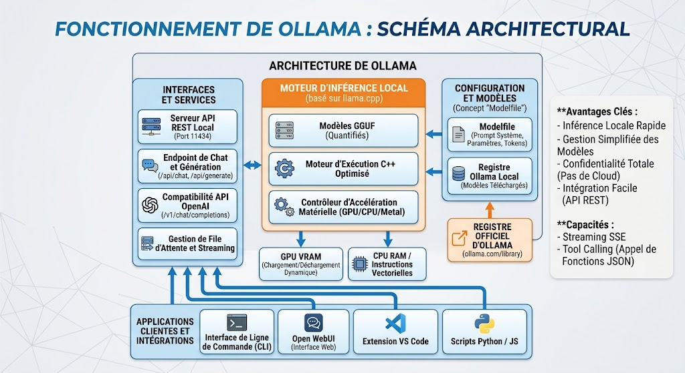
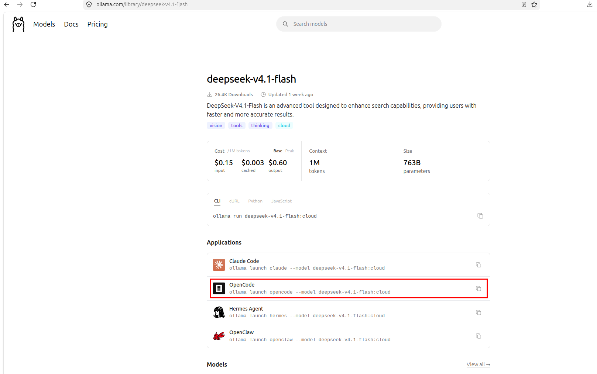

## Principe de fonctionnement
**Ollama** est un outil open-source conçu pour exécuter, gérer et servir des modèles de langage (LLM) localement sur votre machine, sans dépendre d'API cloud.

Son principe de fonctionnement repose sur la simplification de l'infrastructure sous-jacente pour transformer un modèle de plusieurs gigaoctets en un service local immédiatement utilisable via une ligne de commande ou une API REST.

## Moteur d'exécution sous-jacent : `llama.cpp`

Au cœur d'Ollama se trouve **`llama.cpp`**, une bibliothèque optimisée en C/C++ dédiée à l'inférence ultra-rapide des LLM sur du matériel grand public.

* **Quantification (GGUF) :** Ollama utilise le format de fichier **GGUF**. Ce format stocke les poids des modèles compressés (quantifiés en 4-bit, 8-bit, etc.), réduisant drastiquement l'empreinte en RAM/VRAM tout en préservant la précision de réponse.
* **Accélération matérielle :** Ollama détecte automatiquement l'architecture de votre machine pour décharger les calculs matriciels sur le GPU (Nvidia CUDA, AMD ROCm, Apple Metal / Unified Memory sur puces M-series) ou sur le CPU via les instructions vectorielles (AVX2/AVX-512).

### Abstraction par le *Modelfile* (Inspiration Docker)

Ollama simplifie la gestion des modèles en adoptant la philosophie des conteneurs Docker :

* **Package unifié :** Au lieu d'associer manuellement un fichier de poids (`.gguf`), une configuration de jetons (*tokenizer*), des paramètres de température et des modèles de prompt (*system prompt*), Ollama regroupe le tout dans une unité appelée **Modelfile**.
* **Registres distants :** À l'image d'un `docker pull`, exécuter `ollama run qwen2.5` télécharge le package complet préconfiguré depuis le registre officiel d'Ollama (`[ollama.com/library](https://ollama.com/library)`).

### Architecture du Serveur et API

Lorsque vous démarrez Ollama, un processus démon (*daemon*) tourne en arrière-plan.

* **API REST locale :** Le serveur expose une API par défaut sur le port `11434` (endpoints comme `/api/generate`, `/api/chat` ou une compatibilité avec l'API OpenAI `/v1/chat/completions`).
* **Gestion dynamique de la VRAM :** Ollama charge le modèle en mémoire vidéo à la première requête. Si le modèle reste inactif pendant une durée définie (par défaut 5 minutes), il est automatiquement déchargé pour libérer la VRAM de votre GPU.
* **Support du Tool Calling / Function Calling :** Pour les modèles compatibles (comme Llama 3.1, Qwen 2.5 ou Mistral), Ollama analyse les schémas de fonctions transmis par l'API et formate la sortie pour renvoyer des appels de structures JSON prêts à être exécutés par vos scripts.

## Installation

https://ollama.com/download

## Utilisation du cloud

Il est recommandé (mais pas obligatoire) de prendre un souscription pour 1 mois à ollama (28$). Vous aurez accès à des GPU pour l'execution de vos requètes, ainsi que certain modèle plus puissant ne pouvant pas tourner sur des machines locales. Le gain de temps n'est pas négligeable. Vous aurez largement assez de token pour menez à bien le projet.

## L'API ollama en python

Ollama propose un server REST local pour envoyer ses requètes, il propose également une interface en python pour communiquer avec le server.

Utilisez l'extension jupyter notebook de vscode pour ouvrir ce fichier. Installez les packages manquant dans un venv python.

[Notebook demo](<demo_ollama_gemma4_correction .ipynb>)

## Installation de Opencode

https://opencode.ai/

> [!tip] Documentation
> https://opencode.ai/docs/tui/

## Choix du model

Vous pouvez expérimenter avec plusieurs modèles, c'est tout l'interet de ollama.

Je recommande en particulier [deepseek-v4.1-flash](https://ollama.com/library/deepseek-v4.1-flash), il est accessible seulement sur le cloud, pour le 100% local, [gemma4](https://ollama.com/library/gemma4) de google.

Pour lancer opencode, vous pouvez utiliser le raccourci fournis sur la page de ollama

