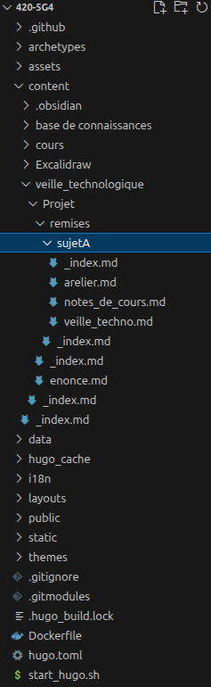

+++
title = "Enoncé"
weight = 1
draft = true
[params]
  menuPre = '<i class="fa-solid fa-scroll"></i> '
+++

## Énoncé

Pour développer les compétences nécessaires à la recherche de nouvelles solutions, la rédaction de notes de cours sur une technologie émergente constitue un excellent exercice pratique. Cette démarche permet de travailler la synthèse d'informations techniques et leur transmission pédagogique.

Vous trouverez [ici](#exemple-de-technologies-a-explorer) une liste de choix possibles, mais vous pouvez choisir le sujet que vous désirez (me contacter avant). Il est possible de faire le travail sur une technologie qui n'est pas émergente, mais que vous n'avez pas vue dans vos cours.

Vous devrez rédiger des notes de cours, écrire un laboratoire pratique et mettre en place une veille technologique.

> Le travail se fait seul ou en équipes de **2 à 3** personnes.

## Évaluation

Ce travail compte pour **40%** de votre session et sera corrigé selon la grille suivante:

|Critère|Pourcentage|
|---|---|
|Notes de cours       | **10%**|
|Laboratoire pratique | **10%**|
|Veille technologique | **10%**|
|Demo                 | **10%**|
|**Total**            | **40%**|

## Spécifications détaillées

Tout ce travail sera réaliser sur ce site même. 
- Vous allez travailler avec la plateforme `Hugo` qui permet de créer un site web statique grace à de simple fichier markdown. 
- Vous utiliserez `git` pour récupérer le site existant, contribuer à l'ajout de nouvelles pages avec vos collaborateurs. 
- Vous vous serverez également de `docker` pour tester vos ajouts au site.

> [!warning] Attention
> Assurez vous que votre site est fonctionnel après chaque push. 
> 
> Pour une garantie maximale, clonez votre site dans un nouveau répertoire et connectez vous a votre site en local.

Référez vous à la section [Méthode de travail](../../base-de-connaissances/methode/) pour une vision plus détaillée.

---

Insérez votre contribution dans la partie [remise](remises) du site: `content->veille_technologique->Projet->remises->VOTRESUJET`. 

Vous pouvez vous inspirer de l'exemple [Sujet A](remises/sujeta) pour les 3 parties de votre projet. 
- Notes de cours
- Atelier
- Veille technologique

Regardez comment est formaté le reste du site si vous souhaitez faire des choses un peu plus avancé (hiérarchie des repertoires, fichiers `index.md` et `_index.md`)

### Notes de cours

Vous expliquez le sujet choisi comme si vous vous adressiez à des étudiants de cinquième session, donc qui ont un bon bagage en informatique, mais qui ne connaissent pas la technologie que vous avez choisie.

Je m'attends à un minimum de 2000 mots (ce que contient environ la page de cours sur docker). Avec vos notes, un étudiant devrait être mesure de comprendre les fondements théoriques de la technologie et d'avoir des exemples de cas d'utilisation.

Il est nécessaire de citer vos sources en fin de page. **Les llms ne sont pas des sources.** 

### Laboratoire
Vous créez une série d'exercices / démonstration qui permettent d'expérimenter la technologie choisie. Les exercices ne doivent pas être trop compliqués et être réalisables pour un néophyte en 2 à 3 heures. Pour estimer le temps que prendront les étudiants, les professeurs multiplient par 2 à 4 le temps qu'il leur faut pour le faire eux-mêmes. Ainsi, si vous êtes capables de faire le laboratoire en 45 minutes, il faudrait normalement de 1h30 à 3h00 pour quelqu'un qui l'essaie pour une première fois.

Les instructions doivent être claires et inclure l'installation. N'hésitez à ajouter des images. Écrivez un laboratoire de la manière que vous auriez aimé que vos professeurs le fassent.

Vous devez inclure un corrigé des exercices.

### Veille technologique

Afin de ne pas présenter du matériel désuet à vos étudiants, vous désirez toujours être au courant des nouveautés.

Vous devez mettre en place une veille technologique sur le sujet que vous avez choisi. Cette veille contiendra minimalement (mais n'a pas besoin de s'y limiter), les éléments suivants:

L'utilisation d'au moins une source humaine: un professeur, un contact, un collègue ou un expert avec qui vous avez communiqué directement.
- L'utilisation de trois moteurs de recherche spécialisés.
- Le suivi d'au moins cinq mot-clés ou ensembles de mots clés à l'aide d'un outil comme Google Alertes.
- L'abonnement à trois flux RSS de sites Web différents.

Il va sans dire que tous les éléments doivent être jugés pertinents (me consulter en cas de doute). Vous décrivez les choix que vous avez faits et les démontrez à l'aide d'une capture d'écran. 

### Démo

Vous devrez également faire une démonstration technique de votre projet. S'il s'agit d'une veille technologique plus théorique, cela prendra la forme d'une présentation.

Dans le cas ou le projet est fait en groupe, tous les membres du groupes doivent être en mesure de faire la démo. La personne faisant la démo sera tiré au hasard le jour j. Soyez tous prêt !

Vous pouvez utilisez votre atelier comme base de présentation, mais attention, la démonstration sera beaucoup plus courte, environ 5 minutes avec les questions.

**La démonstration aura lieu en classe.**

## Exemple de technologies a explorer
- *Langages*: Rust, Go, 
- *stack cloud*: open stack, nextcloud
- *Comment selectionner un serveur web*: apache, nginx,...
- *live coding*
- *sujet théorique*: cryptographie, informatique quantique, l'usage des llm en programmation

## Resources pour l'utilisation de hugo
- Documentation Hugo : https://gohugo.io/documentation/
- Documentation Theme Hugo Relearn: https://mcshelby.github.io/hugo-theme-relearn/index.html
- Dockerfile pour Hugo v148.1 et Relearn v8 (versions compatible avec le site): [Dockerfile](../fichiers/Dockerfile)
- Repos du site : 